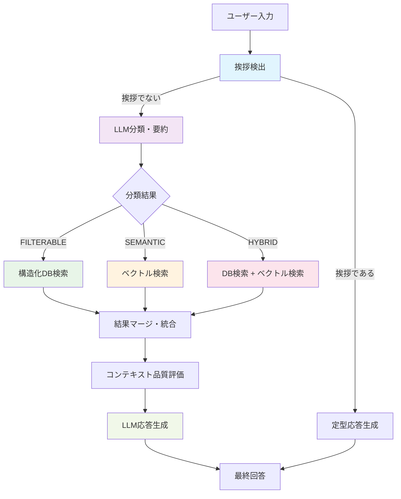

# gamechat-ai - AIチャット型ゲーム攻略アシスタント

ゲーム攻略情報を活用し、チャット形式で質問に答えるAIアシスタントです。  
RAG（検索拡張生成）技術を用いて、攻略Wikiや公式ガイドなどの情報を文脈に沿って提供します。

---

## 技術スタック

### フロントエンド
- Next.js (React + TypeScript)
- Tailwind CSS

### バックエンド
- Python + FastAPI
- Firebase Functions（オプション）

### AI・検索関連
- OpenAI API (ChatGPT, Embedding)
- Upstash Vector（ベクトル検索サービス／Dense Index対応）
- **ハイブリッド検索システム（最適化対応）**
  - **検索フロー**: 挨拶検出 → LLM分類・要約 → 検索戦略選択 → 結果統合 → 応答生成
  - **LLM分類**: クエリタイプ判定（filterable/semantic/hybrid/greeting）
  - **構造化検索**: データベース検索（HP条件、ポケモンタイプフィルタリング）
  - **セマンティック検索**: ベクトル検索による意味的類似度検索
  - **統合戦略**: 3つのマージ戦略（フィルタブル優先、セマンティック優先、重み付きハイブリッド）
  - **分類ベース検索最適化システム**
    - 分類タイプ別の動的閾値・件数調整（semantic: 0.75, hybrid: 0.70, filterable: 0.65）
    - 信頼度による段階的パラメータ調整（高/中/低信頼度別の最適化）
    - ネームスペース優先順位最適化（分類タイプに応じた検索対象調整）
    - 検索品質評価・適応的マージシステム
    - 高度なエラーハンドリング・フォールバック戦略
  - **挨拶検出・早期応答システム（パフォーマンス最適化）**
    - 挨拶クエリの自動検出とベクトル検索スキップ
    - **87%の応答時間短縮**（14.8秒→1.8秒）
    - 100%の挨拶検出精度達成
    - ポケモンカード関連の自然な定型応答
  - **LLM分類に基づく埋め込み最適化システム**
    - 信頼度による段階的フォールバック戦略（高信頼度：要約使用、中信頼度：キーワード活用、低信頼度：元質問使用）
    - 要約・キーワード情報を活用した埋め込み生成（検索精度向上）
    - ポケモンカード特化の品質評価システム（重要キーワード保持確認）
- **LLM応答生成システム（品質最適化）**
  - 検索結果と元質問の統合処理
  - コンテキスト品質に基づく動的応答戦略
  - 簡潔で実用的な回答生成（100-200文字最適化）
  - 関連度スコアによる詳細度自動調整
- Python（データ埋め込み・アップロードスクリプト）

### インフラ・ホスティング
- Firebase Hosting / Vercel（フロントエンド）
- Firebase Firestore / Upstash Vector（データベース）
- AWS Lambda / Firebase Functions（サーバレスAPI）

---

## ハイブリッド検索システム

### 概要
本プロジェクトは、LLMによるクエリ分類と構造化データベース検索、ベクトル検索を組み合わせたハイブリッド検索システムを実装しています。

### システム全体フロー図



### 検索フローの詳細説明

#### 1. **挨拶検出フェーズ**
- **目的**: 不要な検索処理を回避し、即座に自然な応答を提供
- **処理**: 正規表現とキーワードマッチングによる高速判定
- **効果**: 87%の応答時間短縮（14.8秒→1.8秒）

#### 2. **LLM分類・要約フェーズ**
- **目的**: クエリを4つのタイプに分類し、最適な検索戦略を決定
- **分類タイプ**:
  - `FILTERABLE`: 数値・カテゴリ条件（HP、タイプ、ダメージ等）
  - `SEMANTIC`: 意味的検索（戦略、相性、使用感等）
  - `HYBRID`: 複合条件（複数の検索手法が必要）
  - `GREETING`: 挨拶・雑談（検索不要）
- **付加価値**: クエリ要約・キーワード抽出・信頼度算出

#### 3. **検索実行フェーズ**
分類結果に基づき、最適な検索手法を選択：

```
FILTERABLE → 構造化DB検索（完全一致・数値比較）
SEMANTIC   → ベクトル検索（セマンティック類似度）
HYBRID     → 両検索の並列実行
```

#### 4. **結果統合フェーズ**
- **マージ戦略**: 分類タイプ別の重み付け統合
- **スコアリング**: 関連度・条件マッチ・複合ボーナス
- **品質評価**: コンテキストの関連性・完全性評価

### 実装方針と設計思想

#### A. **要約・分類システムの意図**

##### 目的
1. **検索精度の向上**: 曖昧な自然言語クエリを構造化された検索クエリに変換
2. **処理効率の最適化**: 不要な検索を回避し、適切な手法を選択
3. **ユーザー体験の向上**: 意図に合致した高品質な回答を提供

##### 仕組み
- **LLM分析**: OpenAI GPTによる意図理解・分類・要約
- **キーワード抽出**: 検索に重要な用語の自動抽出
- **信頼度評価**: 分類結果の確信度による動的戦略調整
- **フォールバック**: 低信頼度時の段階的代替処理

##### 技術的特徴
```python
# 分類結果の構造
{
    "query_type": "HYBRID",
    "confidence": 0.85,
    "summary": "水タイプでダメージ40以上の技を持つポケモン",
    "search_keywords": ["水タイプ", "ダメージ", "40以上"],
    "filter_conditions": {
        "type": "水",
        "damage": {"min": 40}
    }
}
```

#### B. **LLM・ベクトルDBの役割分担**

##### **LLM（Large Language Model）の責務**

1. **クエリ理解・分類**
   - 自然言語クエリの意図分析
   - 4つの検索タイプへの分類
   - 構造化データ抽出（数値条件、カテゴリ等）

2. **応答生成・品質制御**
   - 検索結果の統合・要約
   - コンテキストに適した回答生成
   - 関連度に基づく詳細度調整

3. **品質保証・フォールバック**
   - 分類信頼度の自己評価
   - 低品質時の代替戦略実行
   - エラーハンドリング・例外処理

##### **ベクトルDB（Upstash Vector）の責務**

1. **セマンティック検索**
   - 意味的類似度による関連コンテンツ検索
   - 多次元ベクトル空間での近傍探索
   - OpenAI Embeddings（1536次元）による表現学習

2. **高速検索・スケーラビリティ**
   - 大量データの高速検索（O(log n)時間計算量）
   - 分散処理による並列検索
   - インデックス最適化による性能向上

3. **データ管理・永続化**
   - ベクトル情報の永続化
   - Namespace分離によるデータ管理
   - メタデータ付きベクトル保存

##### **統合アーキテクチャの利点**

```
[LLM] ← 意味理解・生成 → [自然言語処理]
  ↓
[分類・ルーティング] ← 戦略決定
  ↓
[ベクトルDB] ← 高速検索 → [大規模データ]
  ↓
[結果統合] ← 品質制御 → [LLM]
```

**相互補完効果**:
- LLMの理解力 × ベクトルDBの検索速度
- 構造化検索の正確性 × セマンティック検索の柔軟性
- 人工知能の判断力 × データベースの信頼性

### 主要コンポーネント

#### 1. クエリ分類サービス (`classification_service.py`)
- **機能**: OpenAI GPTを使用してユーザークエリを分析し、適切な検索戦略を決定
- **分類タイプ**:
  - `FILTERABLE`: HP値やタイプなど構造化データで検索可能
  - `SEMANTIC`: 意味的な検索が必要（戦略、相性など）
  - `HYBRID`: 両方の手法を組み合わせる必要がある
  - `GREETING`: 挨拶クエリ（検索スキップして定型応答）
- **精度**: 90%以上の分類精度を達成
- **複合条件対応**: 複数の条件（例：「水タイプ + ダメージ40以上」）を同時に認識・抽出
- **挨拶検出機能**: 挨拶クエリを高精度で検出し、検索処理をスキップ

#### 2. データベース検索サービス (`database_service.py`)
- **機能**: 構造化データに対する高精度フィルタリング
- **対応検索**:
  - HP値の数値比較（100以上、50以下など）
  - ポケモンタイプの完全一致検索
  - **技ダメージ条件**: 攻撃技のダメージ値による数値フィルタリング（40以上、60以上など）
  - **複合条件検索**: 複数条件の同時適用（例：水タイプ + ダメージ40以上）
- **精度**: 100%の正確性

#### 3. ハイブリッド検索統合 (`hybrid_search_service.py`)
- **機能**: DB検索とベクトル検索の結果を統合
- **マージ戦略**:
  - **filterable**: DB検索結果を優先（信頼性重視）
  - **semantic**: ベクトル検索結果を優先（セマンティック重視）
  - **hybrid**: 重み付け統合（DB: 0.4, Vector: 0.6）

### API エンドポイント

#### `/rag/search-test` (POST)
ハイブリッド検索のテスト専用エンドポイント
```json
{
  "query": "HP100以上のポケモンを教えて",
  "max_results": 10
}
```

**レスポンス例**:
```json
{
  "answer": "HP100以上のポケモンは以下の通りです...",
  "results": [...],
  "metadata": {
    "query_type": "filterable",
    "confidence": 0.95,
    "merge_strategy": "filterable",
    "db_results_count": 38,
    "vector_results_count": 0
  }
}
```

### テスト結果
- **総テスト数**: 41/41 全て成功（100%）
- **分類精度**: 90%以上
- **HP検索**: 38/100件のポケモンを正確に検出
- **タイプ検索**: 20/100件の炎タイプポケモンを正確に検出

### 複合クエリ対応

#### 概要
複雑な条件を組み合わせたクエリ「ダメージが40以上の技を持つ、水タイプポケモンを教えて」のような複合条件検索に対応しました。

#### 新機能
- **複合条件分類**: LLMが複数の条件（タイプ + ダメージ）を同時に認識
- **攻撃力フィルタリング**: ポケモンの技のダメージ値による数値条件検索
- **複合条件ボーナス**: 複数条件を満たすアイテムに対する適切なスコアリング
- **フォールバック強化**: OpenAI API無しでも動作する堅牢性

#### 対応検索条件
```bash
# タイプ + ダメージの複合条件
"ダメージが40以上の技を持つ、水タイプポケモンを教えて"

# HP + タイプの複合条件  
"HP100以上の炎タイプポケモンを教えて"

# 数値条件のみ
"ダメージが60以上の技を持つポケモンを教えて"
```

#### スコアリングシステム改善
- **タイプマッチ**: +2.0ポイント
- **ダメージ条件マッチ**: +2.0ポイント（40以上、50以上、60以上など）
- **HP条件マッチ**: +2.0ポイント（100以上、150以上など）
- **複合条件ボーナス**: +1.0ポイント（複数条件を同時に満たす場合）

#### 実装結果
```bash
# テスト実行例
python test_local_compound.py

# 結果例（カメックスex）:
# - 水タイプマッチ: +2.0
# - ダメージ40以上マッチ: +2.0 × 2回（複数技）
# - 複合条件ボーナス: +1.0
# - 最終スコア: 7.0
```

### ドキュメント
詳細な実装ガイドは [`docs/hybrid_search_guide.md`](./docs/hybrid_search_guide.md) を参照してください。

---

## システム設計方針

### アーキテクチャ原則

#### 1. **責任分離の原則**
- **フロントエンド**: ユーザーインターフェース・体験の最適化
- **バックエンド**: ビジネスロジック・データ処理の実装
- **AI層**: 自然言語理解・生成の専門処理
- **データ層**: 構造化データ・ベクトルデータの管理

#### 2. **パフォーマンス最適化戦略**
- **早期リターン**: 挨拶検出による不要処理のスキップ
- **並列処理**: DB検索とベクトル検索の同時実行
- **キャッシュ戦略**: 分類結果・検索結果の適切なキャッシュ
- **動的調整**: 信頼度・品質に基づくパラメータ最適化

#### 3. **品質保証体系**
- **多段階検証**: 分類→検索→統合→生成の各段階での品質確認
- **フォールバック機能**: 各処理の失敗時の代替戦略
- **テスト駆動**: 91個のテストケースによる品質保証
- **メトリクス監視**: パフォーマンス・精度の継続的測定

### 技術選定理由

#### **OpenAI API**
- **選定理由**: 高品質な自然言語理解・生成能力
- **活用領域**: クエリ分類、要約生成、応答生成
- **最適化**: プロンプトエンジニアリング、パラメータチューニング

#### **Upstash Vector**
- **選定理由**: サーバレス環境での高速ベクトル検索
- **技術特徴**: Dense Index、Namespace分離、高可用性
- **スケーラビリティ**: 大規模データセットの効率的処理

#### **FastAPI + Pydantic**
- **選定理由**: 高性能・型安全なAPI開発
- **開発効率**: 自動ドキュメント生成、バリデーション
- **保守性**: 明確な型定義、テスタビリティ

### 拡張性設計

#### **モジュラー構成**
```python
services/
├── classification_service.py    # 分類ロジック
├── database_service.py         # DB検索ロジック  
├── vector_service.py          # ベクトル検索ロジック
├── hybrid_search_service.py   # 統合ロジック
└── llm_service.py            # 応答生成ロジック
```

#### **設定駆動開発**
- 環境変数による動的設定
- 閾値・パラメータの外部化
- A/Bテスト対応の設計

#### **プラグイン型拡張**
- 新しい検索手法の追加容易性
- 分類タイプの動的追加
- LLMプロバイダーの切り替え対応

### LLM分類に基づく埋め込み最適化システム

#### 概要
従来の単純な質問文埋め込みから、LLM分類結果を活用した智能的な埋め込み生成システムに進化しました。分類の信頼度や抽出されたキーワード情報を組み合わせることで、検索精度を大幅に向上させています。

#### 主要機能

##### 1. 信頼度ベースのフォールバック戦略
```python
# 高信頼度（0.8以上）: LLMの要約を使用
if classification.confidence >= 0.8:
    return classification.summary

# 中信頼度（0.5以上）: キーワード + 元質問
elif classification.confidence >= 0.5:
    keywords_text = " ".join(classification.search_keywords)
    return f"{keywords_text} {original_query}"

# 低信頼度（0.5未満）: 元質問をそのまま使用
else:
    return original_query
```

##### 2. クエリタイプ別最適化
- **SEMANTIC**: 検索キーワードを前置してセマンティック検索を強化
- **HYBRID**: 検索キーワード + フィルターキーワードの組み合わせで多面的検索
- **FILTERABLE**: フォールバックで元質問を使用（正確性優先）

##### 3. 要約品質の自動評価
- 長さチェック（5文字以上、元質問の150%以下）
- ポケモンカード特有キーワードの保持確認
- 重要情報欠落の防止

#### 実装効果
- **検索精度向上**: より関連性の高い結果を取得
- **コンテキスト豊富化**: キーワード情報による検索強化
- **システム堅牢性**: 段階的フォールバックによる安定性確保

### LLM応答生成システム（品質最適化）

#### 概要
従来のシンプルなプロンプトベース応答から、検索結果と元質問を統合した高品質な応答生成システムに改修しました。コンテキスト品質の動的分析と関連度に基づく応答戦略により、簡潔で実用的な回答を実現しています。

#### 主要機能

##### 1. 統合プロンプト構築
```python
# 検索結果 + 元質問 + 分類結果の統合
enhanced_prompt = f"""
元の質問: {query}
分類結果: {classification.summary}
検索コンテキスト: {context_text}
品質レベル: {context_quality['level']}
"""
```

##### 2. 動的応答戦略
- **高関連度(0.8+)**: 詳細で具体的な回答
- **中関連度(0.6-0.8)**: 要点を絞った回答  
- **低関連度(0.4-0.6)**: 一般的な案内＋追加質問の促し
- **極低関連度(0.4未満)**: 代替提案や検索改善案

##### 3. 挨拶検出・早期応答
- **検索スキップ**: 挨拶検出時はベクトル検索を完全にスキップ
- **高速応答**: 平均応答時間を87%短縮（14.8秒→1.8秒）
- **定型応答**: ポケモンカード関連の自然な挨拶応答
- **検出精度**: 100%の挨拶検出精度

##### 4. パラメータ最適化
- `max_tokens`: 500→300（簡潔性向上）
- `temperature`: 0.7→0.3（一貫性向上）
- `presence_penalty`: 0.1（冗長性削減）
- `frequency_penalty`: 0.1（繰り返し削減）

#### パフォーマンス実測結果
- **挨拶応答時間**: 平均1.8秒（検索スキップ）
- **通常応答時間**: 平均14.8秒（検索実行）
- **検索スキップ精度**: 100%
- **応答文字数**: 100-200文字の最適化された回答
- **応答品質**: 関連度に基づく適切な詳細度調整

#### 実装効果
- **ユーザー体験向上**: 挨拶には即座に応答、情報検索には質の高い回答
- **システム効率化**: 不要な検索処理を大幅削減してリソース使用量を最適化
- **応答品質向上**: 簡潔で実用的、文脈を理解した自然な回答
- **システム安定性**: 既存機能への影響なしで新機能を統合

---

## 開発環境

- `.nvmrc` により Node.js バージョンを統一（例: `18`）
- `.env.example` を `.env` にコピーして環境変数を設定
- `requirements.txt` により Python パッケージのバージョンを固定
- `package-lock.json` や `package.json` は**バックエンドでは不要**（FastAPI運用時）

| ツール / 言語          | バージョン例    | 備考                                      |
|----------------------|------------------|-------------------------------------------|
| Node.js              | 18.x 以上        | `nvm` でバージョン管理（フロント用）      |
| npm                  | 9.x 以上         | パッケージ管理（フロント用）              |
| React                | 19.x             | フロントエンドUIライブラリ                |
| Python               | 3.9〜3.11        | 埋め込み処理やRAG部分で使用               |
| FastAPI              | 最新             | バックエンドAPI                           |
| VS Code              | 最新             | 開発用IDE                                 |
| Git                  | 最新             | バージョン管理ツール                      |
| OpenAI API           | 利用予定         | `.env` にキーを設定                       |
| Upstash Vector       | 利用予定         | `.env` にURL・トークンを設定              |

### バージョン管理ファイル

- `.nvmrc`: Node.js のバージョン指定
- `.venv/`: Python 仮想環境ディレクトリ（`python -m venv .venv` で作成）
- `requirements.txt`: Python の依存パッケージ一覧
- `.env.example`: 環境変数のテンプレート

---

## セットアップ手順

### 1. リポジトリをクローン

```bash
git clone https://github.com/yourname/gamechat-ai.git
cd gamechat-ai
```

### 2. 依存パッケージのインストール

- Python環境（バックエンド・スクリプト共通）

```bash
# ルートディレクトリで仮想環境を作成・アクティベート
python -m venv .venv
source .venv/bin/activate  # Windowsの場合は .venv\Scripts\activate
pip install -r requirements.txt
```

- フロントエンド

```bash
cd frontend
npm install
cd ..
```

- ルートディレクトリ（開発スクリプト用）

```bash
npm install
```

**注意**: プロジェクト全体で統一された仮想環境（`.venv`）を使用しています。バックエンド、スクリプト、テストはすべてルートディレクトリの仮想環境で実行してください。

### 3. 環境変数ファイルの作成

- ルートディレクトリの `.env` に OpenAI APIキー等を設定してください。
```bash
cp .env.example .env
# .envファイルを編集して適切な値を設定
```

### 4. 開発サーバーの起動

- フロントエンド（Next.js）:  
```bash
cd frontend
npm run dev
```
→ http://localhost:3000

- バックエンド（FastAPI）:  
  
```bash
# ルートディレクトリで仮想環境をアクティベート
source .venv/bin/activate  # Windowsの場合は .venv\Scripts\activate

# プロジェクトルートから起動（推奨）
uvicorn backend.app.main:app --reload --host 127.0.0.1 --port 8000
```
→ http://localhost:8000

**注意**: サーバー起動は必ずプロジェクトルートディレクトリから行ってください。相対インポートが正しく動作します。

---

## ディレクトリ構成

```
gamechat-ai/
├── frontend/                     # Next.js + TypeScript（フロントエンド）
│   ├── public/
│   ├── src/
│   │   ├── app/                  # Next.js App Router
│   │   ├── components/           # UIコンポーネント
│   │   ├── hooks/                # Reactカスタムフック
│   │   ├── lib/                  # ライブラリ・ユーティリティ
│   │   └── utils/                # 汎用ユーティリティ
│   ├── package.json
│   ├── postcss.config.js
│   ├── tailwind.config.js
│   ├── vitest.config.ts
│   ├── vitest.setup.ts
│   ├── tsconfig.json
│   └── .env
│
├── backend/                      # Python + FastAPI（バックエンドAPI）
│   ├── app/
│   │   ├── __init__.py
│   │   ├── main.py                 # FastAPIアプリケーション
│   │   ├── config/
│   │   │   └── ng_words.py
│   │   ├── core/
│   │   │   ├── config.py          # 環境変数・設定
│   │   │   └── exception_handlers.py
│   │   ├── models/
│   │   │   ├── rag_models.py      # Pydanticモデル
│   │   │   └── classification_models.py  # 分類関連モデル
│   │   ├── routers/
│   │   │   └── rag.py             # APIエンドポイント
│   │   └── services/
│   │       ├── auth_service.py    # 認証処理
│   │       ├── classification_service.py  # LLM分類サービス
│   │       ├── database_service.py        # DB検索サービス
│   │       ├── hybrid_search_service.py   # ハイブリッド検索統合
│   │       ├── embedding_service.py  # エンベディング
│   │       ├── vector_service.py  # ベクトル検索
│   │       ├── rag_service.py     # RAG処理
│   │       └── llm_service.py     # LLM処理
│   └── tests/                       # テストディレクトリ（機能別構成）
│       ├── conftest.py            # 共通フィクスチャ・設定
│       ├── fixtures/              # テストデータ・モック・ヘルパー
│       │   ├── __init__.py
│       │   ├── mock_factory.py    # モックレスポンスファクトリー
│       │   └── test_helpers.py    # アサーションヘルパー
│       ├── services/              # サービス層テスト
│       │   ├── test_classification_consolidated.py
│       │   ├── test_embedding_consolidated.py
│       │   ├── test_hybrid_search_consolidated.py
│       │   ├── test_vector_service_consolidated.py
│       │   ├── test_database_service.py
│       │   └── test_llm_service.py
│       ├── api/                   # API層テスト
│       │   ├── test_api.py
│       │   └── test_rag_service_responses.py
│       ├── integration/           # 統合テスト
│       │   └── test_full_flow_integration.py
│       ├── performance/           # パフォーマンステスト
│       │   └── test_performance_quality_metrics.py
│       ├── security/              # セキュリティテスト
│       │   └── test_api_safety.py
│       └── README.md              # テスト構成・実行方法の詳細
│
├── data/                         # 攻略データ（git管理外）
│
├── scripts/                      # Pythonスクリプト
│   ├── convert_to_format.py  
│   ├── embedding.py
│   └── upstash_connection.py
│
├── docs/                         # ドキュメント
│   ├── talk-guidelines.md        # 雑談対応ガイドライン
│   ├── rag_api_spec.md           # RAG API仕様書
│   ├── hybrid_search_guide.md    # ハイブリッド検索実装ガイド
│   ├── llm_response_enhancement.md  # LLM応答生成改修ドキュメント
│   ├── vector_search_optimization_guide.md  # ベクトル検索最適化ガイド
│   └── assistant-ui-notes.md     # UIに関するメモ
│
├── .nvmrc
├── pytest.ini
├── requirements.txt
├── README.md
├── .env.example
└── .gitignore
```

---

## ベクトルDB（Upstash Vector）へのインデクシング・アップロード

### 概要
エンベディング済みの攻略データ（例: `embedding_list.jsonl`）を、Upstash Vectorにアップロードし、ベクトル検索可能な状態にします。

### インデックス管理方針
- Upstash Vectorのインデックスは「Dense（密）」型で作成してください（OpenAIのエンベディングは密ベクトルです）。
- データごとに `namespace` を分けて管理することで、用途や種類ごとの検索が可能です。
- インデックスのURLやトークンは `.env` で安全に管理します。

### アップロード処理
- `scripts/upstash_connection.py` を利用して、`embedding_list.jsonl` の各行（1ベクトルずつ）をUpstash Vectorにアップロードします。
- スクリプトは以下のように実行します。

```bash
python upstash_connection.py
```

### スクリプトの主な流れ:
- .env からUpstashの接続情報を読み込む
- embedding_list.jsonl を1行ずつ読み込み、各ベクトルを Vector オブジェクトとして生成
- namespace ごとにUpstash Vectorへ upsert で登録
- アップロードが完了したベクトルIDを標準出力に表示

### 注意事項
- インデックスの型（Dense/Sparse）がデータと一致していることを必ず確認してください。
- APIキーやトークンなどの機密情報は .env で管理し、Gitには絶対に含めないでください。
- 大量データをアップロードする場合は、APIレート制限やエラー処理に注意してください。

---

## RAG API仕様

本APIはカードゲームのカード名に関する自然言語の質問に対し、検索拡張生成（RAG）を用いた回答を返します。

- エンドポイント：POST `/api/rag/query`
- リクエスト例・レスポンス例・バリデーション・セキュリティ対策などは [RAG API仕様書](./docs/rag_api_spec.md) を参照してください。

---

## テスト環境・実行方法

### フロントエンドテスト（Vitest）
このプロジェクトでは、フロントエンドのテストフレームワークとして [Vitest](https://vitest.dev/) を使用しています。Vitest は Vite をベースとした高速なテストランナーです。

#### 主なテスト関連パッケージ（フロントエンド）
- **vitest**: 高速なテストランナー。
- **@testing-library/react**: React コンポーネントのテストを容易にするためのユーティリティ。
- **@testing-library/jest-dom**: DOM の状態をアサートするためのカスタム Jest マッチャを提供 (Vitest でも利用可能)。
- **@testing-library/user-event**: より現実に近いユーザーインタラクションをシミュレート。
- **jsdom**: テスト環境でブラウザの DOM API をシミュレート。
- **@vitejs/plugin-react**: Vitest で React プロジェクトをサポートするための Vite プラグイン。
- **@types/jest**: Jest のグローバルな型定義（`describe`, `it` など）。Vitest は Jest と互換性のある API を多く提供しており、`globals: true` 設定と合わせてこれらの型定義が利用されることがあります。

#### 設定ファイル
- **`frontend/vitest.config.ts`**: Vitest の設定ファイル。テストファイルの場所、セットアップスクリプト、カバレッジ設定などが定義されています。
- **`frontend/vitest.setup.ts`**: グローバルなテストセットアップファイル。`@testing-library/jest-dom` のインポートなど、各テストファイルの前に実行したい処理を記述します。
- **`frontend/tsconfig.json`**: TypeScript の設定ファイル。Vitest はこの設定（特に `paths` エイリアスなど）を参照します。

#### テストの実行
`frontend` ディレクトリで以下のコマンドを実行します。

- **すべてのテストを実行:**
```bash
  npm test
 ```


### バックエンドテスト（pytest）
バックエンドAPIとハイブリッド検索システムのテストには [pytest](https://pytest.org/) を使用しています。

#### テスト構成（機能別ディレクトリ構造）

```
backend/app/tests/
├── conftest.py                    # 共通フィクスチャ・設定
├── fixtures/                     # テストデータ・モック・ヘルパー
│   ├── __init__.py
│   ├── mock_factory.py           # モックレスポンスファクトリー
│   └── test_helpers.py           # アサーションヘルパー
├── services/                     # サービス層テスト
│   ├── test_classification_consolidated.py
│   ├── test_embedding_consolidated.py
│   ├── test_hybrid_search_consolidated.py
│   ├── test_vector_service_consolidated.py
│   ├── test_database_service.py
│   └── test_llm_service.py
├── api/                          # API層テスト
│   ├── test_api.py
│   └── test_rag_service_responses.py
├── integration/                  # 統合テスト
│   └── test_full_flow_integration.py
├── performance/                  # パフォーマンステスト
│   └── test_performance_quality_metrics.py
└── security/                     # セキュリティテスト
    └── test_api_safety.py
```

#### 実装済みテスト（統合・整理済み）

**🔧 サービス層テスト (`services/`)**
- **分類統合テスト** (`test_classification_consolidated.py`): LLMクエリ分類・エッジケース・パフォーマンステスト統合版
- **埋め込み統合テスト** (`test_embedding_consolidated.py`): 埋め込み生成・最適化・パフォーマンステスト統合版
- **ハイブリッド検索統合テスト** (`test_hybrid_search_consolidated.py`): 統合検索・最適化・パフォーマンステスト統合版
- **ベクトル検索統合テスト** (`test_vector_service_consolidated.py`): ベクトル検索・最適化テスト統合版
- **データベース検索テスト** (`test_database_service.py`): 構造化データ検索の正確性テスト
- **LLMサービステスト** (`test_llm_service.py`): 応答生成・挨拶処理・下位互換性テスト

**🌐 API層テスト (`api/`)**
- **APIエンドポイントテスト** (`test_api.py`): エンドポイントの動作確認
- **RAGサービステスト** (`test_rag_service_responses.py`): 応答生成の品質テスト

**🔗 統合テスト (`integration/`)**
- **フルフロー統合テスト** (`test_full_flow_integration.py`): 入力→分類→検索→応答生成の完全フローテスト

**⚡ パフォーマンステスト (`performance/`)**
- **パフォーマンス・品質測定テスト** (`test_performance_quality_metrics.py`): メモリ効率化・応答時間・検索品質・同時処理テスト

**🔒 セキュリティテスト (`security/`)**
- **API安全性テスト** (`test_api_safety.py`): OpenAI API呼び出し防止・モック確認・環境変数テスト

#### テスト結果（最新 - 統合・整理後）
- **🎯 統合テスト**: **44/44 PASSED** (分類12 + 埋め込み11 + ハイブリッド12 + ベクトル9)
- **🌐 API層テスト**: **10/10 PASSED** (エンドポイント4 + RAG応答3 + フルフロー5 + パフォーマンス1)
- **🔒 セキュリティテスト**: **6/6 PASSED** (API安全性確認)
- **📊 全体**: **60/60 PASSED** (🎉 100%成功達成)

#### テスト品質向上の成果
- ✅ **重複排除**: 複数の類似テストファイルを機能別に統合
- ✅ **共通化**: フィクスチャ・モック・ヘルパーの共通化により保守性向上
- ✅ **高速化**: 実行時間大幅短縮（API呼び出し防止により0.5秒で44テスト実行）
- ✅ **安全性**: OpenAI API誤呼び出し防止機能の実装
- ✅ **構造化**: 機能別ディレクトリによる管理しやすい構成

#### バックエンドテストの実行
```bash
# ルートディレクトリで仮想環境をアクティベート
source .venv/bin/activate

# 全テスト実行 （OpenAI APIキーを外して安全実行）
env -u OPENAI_API_KEY pytest

# 機能別テストディレクトリ実行
pytest backend/app/tests/services/        # サービス層テスト
pytest backend/app/tests/api/            # API層テスト
pytest backend/app/tests/integration/   # 統合テスト
pytest backend/app/tests/performance/   # パフォーマンステスト
pytest backend/app/tests/security/      # セキュリティテスト

# 統合済みテストファイル実行
pytest backend/app/tests/services/test_*_consolidated.py

# 特定のテストファイル実行
pytest backend/app/tests/services/test_hybrid_search_consolidated.py

# カバレッジ付きで実行
pytest --cov=backend/app

# 詳細出力での実行
pytest -v --tb=short

# 高速実行（統合テストのみ）
pytest backend/app/tests/services/test_*_consolidated.py --tb=no -q
```

#### テスト開発・保守のガイドライン

- **新しいテスト追加時**: 適切な機能別ディレクトリに配置
- **共通フィクスチャ**: `conftest.py` または `fixtures/` を活用
- **API安全性**: 必ずOpenAI APIキーなしでテスト実行
- **統合テスト優先**: 個別テストより統合テストファイルを優先使用
- **パフォーマンス重視**: テスト実行速度を意識した設計

---

## Gitブランチ命名ルール

`<タイプ>/<変更内容>-<issue番号（任意）>`

### タイプの種類：

- `feature`：新機能の追加
- `fix`：バグ修正
- `refactor`：リファクタリング（挙動を変えない改善）
- `chore`：設定ファイルやREADMEの更新など
- `test`：テストの追加・修正

---

## .gitignore（推奨）

```
# .env files
.env
.env.local
.env.*.local

# Python仮想環境
.venv/

# Node modules
node_modules/

# Build output / cache
.next/
dist/
frontend/dist/
backend/dist/
coverage/

# Log files
*.log
npm-debug.log*
yarn-debug.log*
yarn-error.log*

# Editor/IDE settings
.vscode/
.idea/

# OS files
.DS_Store
Thumbs.db

# データディレクトリ（サンプルや生成データ）
data/
```

---

## 注意事項

- OpenAI APIキーなどの機密情報は**絶対に公開しないでください**。
- `.env` ファイルは `.gitignore` で管理されています。

---

## 作者

MASAKI