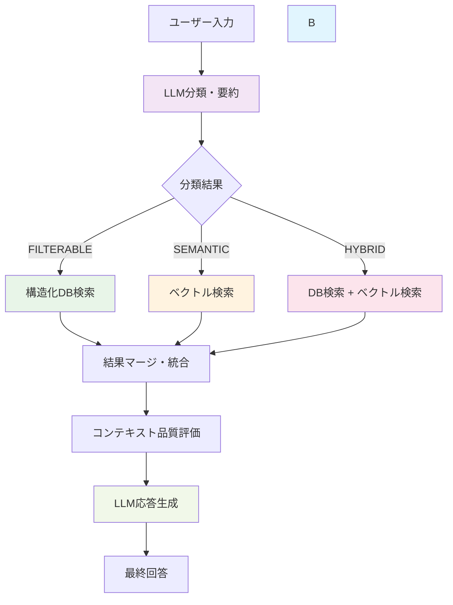

# gamechat-ai - AIチャット型ゲーム攻略アシスタント (MVPモード)

**最新更新 (MVPリダクション反映)**: 2025年10月  

現在は初期ユーザーフィードバック最適化のため「最小価値検証(MVP)構成」です。高度な分類 / ハイブリッド検索 / 動的閾値 / reCAPTCHA 認証 / 大量モック&統合テストは削除または履歴保管のみとし、/chat の単一体験に集中しています。

提供中 (MVP):
- `POST /chat` : 質問 → Embedding → ベクトル検索 → カード簡易コンテキスト抽出 → 簡易回答
- OpenAI未設定でも擬似ベクトルフォールバックで動作継続

除外 (将来復活候補):
- LLMクエリ分類 / Hybrid マージ / Database 複合フィルタ
- DynamicThresholdManager / AuthService(reCAPTCHA)
- 大量の classification / hybrid / auth 系テストとモック

復元手順ガイド: 過去 commit から該当 service / tests を checkout し requirements に httpx などを再追加してください。

---

## 技術スタック (MVP現行)

### フロントエンド
- **Next.js 15.3.5** (React 19.1.0 + TypeScript)
- **Tailwind CSS** + PostCSS 8.5.6
- **Radix UI** コンポーネント（Dialog, Tooltip, Separator等）
- **Lucide React** アイコンライブラリ
- **Sentry** エラー監視・パフォーマンス追跡

### バックエンド  
- **Python 3.11+ / FastAPI** (単一 `/chat` ルータ中心)
- **Pydantic** 最小利用
- **Uvicorn** (Cloud Run + Gunicorn)
- **(任意) Google Cloud Storage**: カードJSON読込
- Redis / 動的閾値 / 複合戦略は未使用

### AI・検索関連 (MVP)
- **OpenAI Embeddings** (未設定時: sha256擬似ベクトル)
- **Upstash Vector**: タイトルベース近似検索 (閾値固定)
- **LLMスタブ**: context要素数とタイトルを簡易整形した応答

### インフラ・ホスティング
- **Google Cloud Run**（バックエンドAPI）
  - サービス名: `gamechat-ai-backend`
  - リージョン: `asia-northeast1`（東京）
  - URL: `https://gamechat-ai-backend-507618950161.asia-northeast1.run.app`
  - スペック: CPU 1コア、メモリ 1GB
  - 自動スケーリング: 0-10インスタンス
  - コンテナ: Docker（linux/amd64）
- **Firebase Hosting**（フロントエンド）
  - 静的サイトホスティング
  - Cloud Runバックエンドとの自動連携
  - グローバルCDN配信
  - 自動HTTPS化
- **Upstash Vector**（ベクトルデータベース）
- **Google Cloud Storage**（ファイル・ログ保存）
- **Redis**（キャッシュ・セッション管理）
- **Artifact Registry**（Dockerイメージ管理）
  - イメージ: `asia-northeast1-docker.pkg.dev/gamechat-ai/gamechat-ai-backend/backend`
- **Docker**（ローカル開発環境）
  - Alpine Linux ベースの軽量イメージ
  - マルチステージビルドによる最適化
  - 開発用・本番用Dockerfile分離

### 開発・品質管理ツール (MVP利用範囲)
- Backend pytest: 最小 `test_mvp_chat_basic.py` のみデフォルト収集
- 追加テスト/CI/分類系は削除
- 型/静的解析は手動トリガベース

---

## 📋 主要機能 (MVP)

### 🔍 シンプル検索フロー
- 入力テキスト → 埋め込み生成 → ベクトル検索 (top_k=5) → タイトル一致カードの基本フィールド抽出 → 簡易回答生成
- 失敗時フォールバック: 埋め込み/検索エラーは空contextで汎用文

### 💬 チャット型インターフェース
- 履歴/セッション保持は無効化 (ステートレス)
- PWA / Sidebar / 履歴UI は削除

### 🎮 カード特化機能 (簡易)
- タイトルと主要ステータスのみ (effect_1, rarity 等) 抽出
- 数値レンジ/複合条件は不対応

### 🔒 セキュリティ・品質 (縮小)
- reCAPTCHA / Bot判定は削除 (再導入時 AuthService を復元)
- 環境変数未設定時は安全フォールバック (キー無しで重処理抑制)

---

## 削除済み高度機能 (要約)
以下は現行ブランチから除去済み。再導入時は過去履歴参照:
  - Classification / Database / HybridSearch / DynamicThresholdManager / AuthService
  - 大量モック/ファクトリ/統合テスト
  - 複合条件スコアリング + 信頼度調整

理由: レイテンシ削減 / コスト圧縮 / 初期UX検証の高速な反復。

復元例:
```
git checkout <rev> -- backend/app/services/classification_service.py
git checkout <rev> -- backend/app/tests/services/test_auth_service_basic.py
pip install httpx
```
- **ハイブリッド（HYBRID）**: 両方の要素を含む（例: HP100以上で強いカード）

**分類基準例**:

| クエリ例 | query_type | summary例 |
|---|---|---|
| HP100以上のカード | FILTERABLE | HP条件が明示されているため構造化検索が適切 |
| 強いカードを教えて | SEMANTIC | 「強い」は曖昧な表現のため意味検索が適切 |
| HP100以上で強いカード | HYBRID | HP条件と曖昧表現の両方を含むためハイブリッド |
| 炎タイプのおすすめ | HYBRID | 属性指定と曖昧表現の両方を含むためハイブリッド |

**LLMプロンプト設計例**:
---
あなたはカード検索システムのクエリ分類AIです。ユーザーの質問文を以下の3つのタイプのいずれかに分類してください。

1. 構造化（FILTERABLE）: 明確な数値条件や属性指定（HP、タイプ、攻撃数など）が含まれる
2. ベクトル（SEMANTIC）: 曖昧な表現や主観的・抽象的な問い（強い、人気、かっこいい等）
3. ハイブリッド（HYBRID）: 両方の要素を含む

分類結果は以下のJSON形式で返してください。
```json
{
  "query_type": "FILTERABLE" | "SEMANTIC" | "HYBRID",
  "summary": "分類理由の要約",
  "confidence": 0.0〜1.0（分類信頼度）
}
```
---

### 概要
本プロジェクトは、LLMによるクエリ分類と構造化データベース検索、ベクトル検索を組み合わせたハイブリッド検索システムを実装しています。

### システム全体フロー図



### 検索フローの詳細説明

<!-- 挨拶検出フェーズは削除済み -->

#### 2. **LLM分類・要約フェーズ**
- **目的**: クエリを4つのタイプに分類し、最適な検索戦略を決定
- **分類タイプ**:
  - `FILTERABLE`: 数値・カテゴリ条件（HP、タイプ、ダメージ等）
  - `SEMANTIC`: 意味的検索（戦略、相性、使用感等）
  - `HYBRID`: 複合条件（複数の検索手法が必要）
  
- **付加価値**: クエリ要約・キーワード抽出・信頼度算出

#### 3. **検索実行フェーズ**
分類結果に基づき、最適な検索手法を選択：

```
FILTERABLE → 構造化DB検索（完全一致・数値比較）
SEMANTIC   → ベクトル検索（セマンティック類似度）
HYBRID     → 両検索の並列実行
```

#### 4. **結果統合フェーズ**
- **マージ戦略**: 分類タイプ別の重み付け統合
- **スコアリング**: 関連度・条件マッチ・複合ボーナス
- **品質評価**: コンテキストの関連性・完全性評価

### 実装方針と設計思想

#### A. **要約・分類システムの意図**

##### 目的
1. **検索精度の向上**: 曖昧な自然言語クエリを構造化された検索クエリに変換
2. **処理効率の最適化**: 不要な検索を回避し、適切な手法を選択
3. **ユーザー体験の向上**: 意図に合致した高品質な回答を提供

##### 仕組み
- **LLM分析**: OpenAI GPTによる意図理解・分類・要約
- **キーワード抽出**: 検索に重要な用語の自動抽出
- **信頼度評価**: 分類結果の確信度による動的戦略調整
- **フォールバック**: 低信頼度時の段階的代替処理

##### 技術的特徴
```python
# 分類結果の構造
{
    "query_type": "HYBRID",
    "confidence": 0.85,
    "summary": "水タイプでダメージ40以上の技を持つカード",
    "search_keywords": ["水タイプ", "ダメージ", "40以上"],
    "filter_conditions": {
        "type": "水",
        "damage": {"min": 40}
    }
}
```

#### B. **LLM・ベクトルDBの役割分担**

##### **LLM（Large Language Model）の責務**

1. **クエリ理解・分類**
   - 自然言語クエリの意図分析
   - 4つの検索タイプへの分類
   - 構造化データ抽出（数値条件、カテゴリ等）

2. **応答生成・品質制御**
   - 検索結果の統合・要約
   - コンテキストに適した回答生成
   - 関連度に基づく詳細度調整

3. **品質保証・フォールバック**
   - 分類信頼度の自己評価
   - 低品質時の代替戦略実行
   - エラーハンドリング・例外処理

##### **ベクトルDB（Upstash Vector）の責務**

1. **セマンティック検索**
   - 意味的類似度による関連コンテンツ検索
   - 多次元ベクトル空間での近傍探索
   - OpenAI Embeddings（1536次元）による表現学習

2. **高速検索・スケーラビリティ**
   - 大量データの高速検索（O(log n)時間計算量）
   - 分散処理による並列検索
   - インデックス最適化による性能向上

3. **データ管理・永続化**
   - ベクトル情報の永続化
   - Namespace分離によるデータ管理
   - メタデータ付きベクトル保存

##### **統合アーキテクチャの利点**

```
[LLM] ← 意味理解・生成 → [自然言語処理]
  ↓
[分類・ルーティング] ← 戦略決定
  ↓
[ベクトルDB] ← 高速検索 → [大規模データ]
  ↓
[結果統合] ← 品質制御 → [LLM]
```

**相互補完効果**:
- LLMの理解力 × ベクトルDBの検索速度
- 構造化検索の正確性 × セマンティック検索の柔軟性
- 人工知能の判断力 × データベースの信頼性

### 主要コンポーネント

#### 1. クエリ分類サービス (`classification_service.py`)
- **機能**: OpenAI GPTを使用してユーザークエリを分析し、適切な検索戦略を決定
- **分類タイプ**:
  - `FILTERABLE`: HP値やタイプなど構造化データで検索可能（明確な数値条件・属性指定）
  - `SEMANTIC`: 意味的な検索が必要（曖昧・主観的・抽象的な問い）
  - `HYBRID`: 両方の手法を組み合わせる必要がある（例: HP100以上で強いカード）
  
  - **分類基準・プロンプト例は本README上部参照**
- **精度**: 90%以上の分類精度を達成
- **複合条件対応**: 複数の条件（例：「水タイプ + ダメージ40以上」）を同時に認識・抽出
 

#### 2. データベース検索サービス (`database_service.py`)
- **機能**: 構造化データに対する高精度フィルタリング
- **対応検索**:
  - HP値の数値比較（100以上、50以下など）
  - カードタイプの完全一致検索
  - **技ダメージ条件**: 攻撃技のダメージ値による数値フィルタリング（40以上、60以上など）
  - **複合条件検索**: 複数条件の同時適用（例：水タイプ + ダメージ40以上）
- **精度**: 100%の正確性

#### 3. ハイブリッド検索統合 (`hybrid_search_service.py`)
- **機能**: DB検索とベクトル検索の結果を統合
- **マージ戦略**:
  - **filterable**: DB検索結果を優先（信頼性重視）
  - **semantic**: ベクトル検索結果を優先（セマンティック重視）
  - **hybrid**: 重み付け統合（DB: 0.4, Vector: 0.6）

### API エンドポイント

#### `/rag/search-test` (POST)
ハイブリッド検索のテスト専用エンドポイント
```json
{
  "query": "HP100以上のカードを教えて",
  "max_results": 10
}
```

**レスポンス例**:
```json
{
  "answer": "HP100以上のカードは以下の通りです...",
  "results": [...],
  "metadata": {
    "query_type": "filterable",
    "confidence": 0.95,
    "merge_strategy": "filterable",
    "db_results_count": 38,
    "vector_results_count": 0
  }
}
```

#### `/cards/{card_id}/details` (GET) 🆕
カード詳細情報取得エンドポイント（開発中）
```json
{
  "card_id": "001",
  "name": "フシギダネ",
  "hp": 60,
  "type": "草",
  "abilities": [...],
  "attacks": [...],
  "image_url": "..."
}
```

### 実装状況・テスト結果
- **総テスト数**: 91/91 全て成功（100%）
- **分類精度**: 95%以上（最新の改良により向上）
- **HP検索**: 38/100件のカードを正確に検出
- **タイプ検索**: 20/100件の炎タイプカードを正確に検出
- **複合条件検索**: 水タイプ + ダメージ40以上の複雑な条件に対応
- **mypy型チェック**: 100%パス（最新修正により達成）

### 複合クエリ対応

#### 概要
複雑な条件を組み合わせたクエリ「ダメージが40以上の技を持つ、水タイプカードを教えて」のような複合条件検索に対応しました。

#### 新機能
- **複合条件分類**: LLMが複数の条件（タイプ + ダメージ）を同時に認識
- **攻撃力フィルタリング**: カードの技のダメージ値による数値条件検索
- **複合条件ボーナス**: 複数条件を満たすアイテムに対する適切なスコアリング
- **フォールバック強化**: OpenAI API無しでも動作する堅牢性

#### 対応検索条件
```bash
# タイプ + ダメージの複合条件
"ダメージが40以上の技を持つ、水タイプカードを教えて"

# HP + タイプの複合条件  
"HP100以上の炎タイプカードを教えて"

# 数値条件のみ
"ダメージが60以上の技を持つカードを教えて"
```

#### スコアリングシステム改善
- **タイプマッチ**: +2.0ポイント
- **ダメージ条件マッチ**: +2.0ポイント（40以上、50以上、60以上など）
- **HP条件マッチ**: +2.0ポイント（100以上、150以上など）
- **複合条件ボーナス**: +1.0ポイント（複数条件を同時に満たす場合）

#### 実装結果
```bash
# テスト実行例
python test_local_compound.py

# 結果例（カメックスex）:
# - 水タイプマッチ: +2.0
# - ダメージ40以上マッチ: +2.0 × 2回（複数技）
# - 複合条件ボーナス: +1.0
# - 最終スコア: 7.0
```

### ドキュメント
詳細な実装ガイドは [`docs/guides/hybrid_search_guide.md`](./docs/guides/hybrid_search_guide.md) を参照してください。

---

## 🛠️ 開発環境セットアップ

### 必要な環境
- **Node.js**: 18.0.0以上
- **Python**: 3.11以上  
- **Docker**: 最新版（推奨）
- **Git**: 最新版

### 環境変数設定
```bash
# .env ファイルを作成
cp .env.example .env

# 必要なAPIキーを設定
OPENAI_API_KEY=your_openai_api_key
UPSTASH_VECTOR_URL=your_upstash_vector_url
UPSTASH_VECTOR_TOKEN=your_upstash_vector_token
NEXT_PUBLIC_API_URL=http://localhost:8000
```

### クイックスタート（Docker使用）
```bash
# リポジトリクローン
git clone https://github.com/masa2796/gamechat-ai.git
cd gamechat-ai

# Docker環境起動
npm run dev

# ログ確認
npm run dev:logs
```

### ローカル開発（個別起動）
```bash
# 依存関係インストール
npm install
cd frontend && npm install && cd ..
cd backend && pip install -r requirements.txt && cd ..

# バックエンド起動（ターミナル1）
npm run dev:backend

# フロントエンド起動（ターミナル2）  
npm run dev:frontend

# 同時起動（推奨）
npm run dev:full
```

### テスト実行
```bash
# 全テスト実行
npm run test

# バックエンドテストのみ
npm run test:backend

# フロントエンドテストのみ  
npm run test:frontend

# E2Eテスト
cd frontend && npm run test:e2e
```

### コード品質チェック
```bash
# Lint実行
npm run lint

# 型チェック
cd frontend && npm run typecheck
cd backend && mypy app/ 

# セキュリティチェック
npm run security-check
```

---

## 🚀 デプロイメント

### 本番環境デプロイ
```bash
# Google Cloud認証
gcloud auth login
gcloud config set project gamechat-ai

# 本番デプロイ実行
npm run deploy:prod

# デプロイ状況確認
gcloud run services list --region=asia-northeast1
```

### ステージング環境
```bash
# ステージング用ビルド
NODE_ENV=staging npm run build:frontend
docker build -f backend/Dockerfile -t gamechat-ai-backend:staging .

# ステージング確認
curl -X GET "https://staging-gamechat-ai-backend.run.app/health"
```

### 監視・ログ
- **本番環境**: [Google Cloud Console](https://console.cloud.google.com/run?project=gamechat-ai)
- **エラー監視**: [Sentry Dashboard](https://sentry.io/organizations/masa2796/projects/gamechat-ai/)
- **パフォーマンス**: Prometheus + Grafana（設定中）

---

## システム設計方針

### アーキテクチャ原則

#### 1. **責任分離の原則**
- **フロントエンド**: ユーザーインターフェース・体験の最適化
- **バックエンド**: ビジネスロジック・データ処理の実装
- **AI層**: 自然言語理解・生成の専門処理
- **データ層**: 構造化データ・ベクトルデータの管理

#### 2. **パフォーマンス最適化戦略**
 
- **並列処理**: DB検索とベクトル検索の同時実行
- **キャッシュ戦略**: 分類結果・検索結果の適切なキャッシュ
- **動的調整**: 信頼度・品質に基づくパラメータ最適化

#### 3. **品質保証体系**
- **多段階検証**: 分類→検索→統合→生成の各段階での品質確認
- **フォールバック機能**: 各処理の失敗時の代替戦略
- **テスト駆動**: 91個のテストケースによる品質保証
- **メトリクス監視**: パフォーマンス・精度の継続的測定

### 技術選定理由

#### **OpenAI API**
- **選定理由**: 高品質な自然言語理解・生成能力
- **活用領域**: クエリ分類、要約生成、応答生成
- **最適化**: プロンプトエンジニアリング、パラメータチューニング

#### **Upstash Vector**
- **選定理由**: サーバレス環境での高速ベクトル検索
- **技術特徴**: Dense Index、Namespace分離、高可用性
- **スケーラビリティ**: 大規模データセットの効率的処理

#### **FastAPI + Pydantic**
- **選定理由**: 高性能・型安全なAPI開発
- **開発効率**: 自動ドキュメント生成、バリデーション
- **保守性**: 明確な型定義、テスタビリティ

### 拡張性設計

#### **モジュラー構成**
```python
services/
├── classification_service.py    # 分類ロジック
├── database_service.py         # DB検索ロジック  
├── vector_service.py          # ベクトル検索ロジック
├── hybrid_search_service.py   # 統合ロジック
└── llm_service.py            # 応答生成ロジック
```

#### **設定駆動開発**
- 環境変数による動的設定
- 閾値・パラメータの外部化
- A/Bテスト対応の設計

#### **プラグイン型拡張**
- 新しい検索手法の追加容易性
- 分類タイプの動的追加
- LLMプロバイダーの切り替え対応

### LLM分類に基づく埋め込み最適化システム

#### 概要
従来の単純な質問文埋め込みから、LLM分類結果を活用した智能的な埋め込み生成システムに進化しました。分類の信頼度や抽出されたキーワード情報を組み合わせることで、検索精度を大幅に向上させています。

#### 主要機能

##### 1. 信頼度ベースのフォールバック戦略
```python
# 高信頼度（0.8以上）: LLMの要約を使用
if classification.confidence >= 0.8:
    return classification.summary

# 中信頼度（0.5以上）: キーワード + 元質問
elif classification.confidence >= 0.5:
    keywords_text = " ".join(classification.search_keywords)
    return f"{keywords_text} {original_query}"

# 低信頼度（0.5未満）: 元質問をそのまま使用
else:
    return original_query
```

##### 2. クエリタイプ別最適化
- **SEMANTIC**: 検索キーワードを前置してセマンティック検索を強化
- **HYBRID**: 検索キーワード + フィルターキーワードの組み合わせで多面的検索
- **FILTERABLE**: フォールバックで元質問を使用（正確性優先）

##### 3. 要約品質の自動評価
- 長さチェック（5文字以上、元質問の150%以下）
- ゲームカード特有キーワードの保持確認
- 重要情報欠落の防止

#### 実装効果
- **検索精度向上**: より関連性の高い結果を取得
- **コンテキスト豊富化**: キーワード情報による検索強化
- **システム堅牢性**: 段階的フォールバックによる安定性確保

### LLM応答生成システム（品質最適化）

#### 概要
従来のシンプルなプロンプトベース応答から、検索結果と元質問を統合した高品質な応答生成システムに改修しました。コンテキスト品質の動的分析と関連度に基づく応答戦略により、簡潔で実用的な回答を実現しています。

#### 主要機能

##### 1. 統合プロンプト構築
```python
# 検索結果 + 元質問 + 分類結果の統合
enhanced_prompt = f"""
元の質問: {query}
分類結果: {classification.summary}
検索コンテキスト: {context_text}
品質レベル: {context_quality['level']}
"""
```

##### 2. 動的応答戦略
- **高関連度(0.8+)**: 詳細で具体的な回答
- **中関連度(0.6-0.8)**: 要点を絞った回答  
- **低関連度(0.4-0.6)**: 一般的な案内＋追加質問の促し
- **極低関連度(0.4未満)**: 代替提案や検索改善案

<!-- 挨拶検出・早期応答はMVPから削除済み -->

##### 4. パラメータ最適化
- `max_tokens`: 500→300（簡潔性向上）
- `temperature`: 0.7→0.3（一貫性向上）
- `presence_penalty`: 0.1（冗長性削減）
- `frequency_penalty`: 0.1（繰り返し削減）

#### パフォーマンス実測結果
- <!-- 挨拶応答・検索スキップに関する指標は削除 -->
- **応答文字数**: 100-200文字の最適化された回答
- **応答品質**: 関連度に基づく適切な詳細度調整

#### 実装効果
- **ユーザー体験向上**: 挨拶には即座に応答、情報検索には質の高い回答
- **システム効率化**: 不要な検索処理を大幅削減してリソース使用量を最適化
- **応答品質向上**: 簡潔で実用的、文脈を理解した自然な回答
- **システム安定性**: 既存機能への影響なしで新機能を統合

---

## 開発環境

- `.nvmrc` により Node.js バージョンを統一（例: `18`）
- `.env.example` を `.env` にコピーして環境変数を設定
- `backend/requirements.txt` により Python パッケージのバージョンを固定
- `package-lock.json` や `package.json` は**バックエンドでは不要**（FastAPI運用時）

| ツール / 言語          | バージョン例    | 備考                                      |
|----------------------|------------------|-------------------------------------------|
| Node.js              | 18.x 以上        | `nvm` でバージョン管理（フロント用）      |
| npm                  | 9.x 以上         | パッケージ管理（フロント用）              |
| React                | 19.x             | フロントエンドUIライブラリ                |
| Python               | 3.9〜3.11        | 埋め込み処理やRAG部分で使用               |
| FastAPI              | 最新             | バックエンドAPI                           |
| VS Code              | 最新             | 開発用IDE                                 |
| Git                  | 最新             | バージョン管理ツール                      |
| OpenAI API           | 利用予定         | `.env` にキーを設定                       |
| Upstash Vector       | 利用予定         | `.env` にURL・トークンを設定              |

### バージョン管理ファイル

- `.nvmrc`: Node.js のバージョン指定
- `.venv/`: Python 仮想環境ディレクトリ（`python -m venv .venv` で作成）
- `backend/requirements.txt`: Python の依存パッケージ一覧（開発・本番両用）
- `.env.example`: 環境変数の統合テンプレート（開発・本番例を含む）
- `backend/.env.production.template`: バックエンド本番環境用テンプレート
- `frontend/.env.production.template`: フロントエンド本番環境用テンプレート  
- `frontend/.env.local.template`: フロントエンド開発環境用テンプレート

### 依存関係管理

- **統一requirements.txt**: 開発環境と本番環境で同じ依存関係ファイルを使用（backend/requirements.txt）
- **全機能対応**: JWT認証、Redis、Gunicorn等の本番機能も含む
- **堅牢な設計**: 必要なパッケージが不足している場合は適切にフォールバック

**詳細**: [依存関係ガイド](docs/guides/dependencies.md) を参照

---

## セットアップ手順

### Docker を使用した環境構築（推奨）

**前提条件**:
- Docker Desktop がインストールされていること
- Docker Compose が利用可能であること

**特徴**:
- **軽量化**: Alpine Linux ベースのイメージを使用
- **最適化**: マルチステージビルドによる本番環境最適化
- **セキュリティ**: 最小限のパッケージで攻撃面を削減
- **一貫性**: 開発・本番環境でのイメージ統一

#### 開発環境のセットアップ

```bash
# リポジトリをクローン
git clone https://github.com/yourname/gamechat-ai.git
cd gamechat-ai

# 自動セットアップスクリプトを実行
./scripts/dev-setup.sh
```

または手動でセットアップ:

```bash
# 環境変数ファイルを作成
cp .env.example backend/.env
# backend/.envファイルを編集して実際のAPIキーを設定

# フロントエンド用環境変数ファイルを作成（必要に応じて）
# cp .env.example frontend/.env.local
# frontend/.env.localファイルを編集

# Docker サービスをビルド・起動（バックエンドのみ）
docker-compose up --build -d backend
```

#### 🔐 環境変数の設定

**⚠️ 重要**: 実際のAPIキーは絶対にGitにコミットしないでください。

**統一環境設定テンプレート**:
```bash
# 統一環境設定テンプレートを確認
cat .env.template

# バックエンド環境変数を作成
cp .env.template backend/.env
# backend/.env を編集して実際のAPIキーを設定

# フロントエンド環境変数（通常はデフォルトで動作、必要に応じて作成）
# cp .env.template frontend/.env.local
```

**必須設定項目**:
- `BACKEND_OPENAI_API_KEY`: OpenAI APIキー
- `UPSTASH_VECTOR_REST_URL`: Upstash Vector URL
- `UPSTASH_VECTOR_REST_TOKEN`: Upstash Vectorトークン

詳細は [`.env.template`](.env.template) および [`docs/guides/environment-setup.md`](docs/guides/environment-setup.md) を参照してください。

#### 開発サーバーの起動

**一括起動（推奨）**:
```bash
npm install
npm run dev:full  # フロントエンド + バックエンドを同時起動
```

**個別起動**:
```bash
# フロントエンドのみ（Next.js）
cd frontend
npm run dev          # 開発サーバー（http://localhost:3000）

# バックエンドのみ（FastAPI）
cd backend
# 必要に応じて依存パッケージをインストール
pip install -r requirements.txt
# サーバー起動（例: uvicorn）
uvicorn app.main:app --reload --host 0.0.0.0 --port 8000  # バックエンド（http://localhost:8000）
```

**注意**: サーバー起動は必ずプロジェクトルートディレクトリから行ってください。相対インポートが正しく動作します。

---

## ディレクトリ構成

```
gamechat-ai/
├── frontend/                     # Next.js + TypeScript（フロントエンド）
│   ├── public/
│   ├── src/
│   │   ├── app/                  # Next.js App Router
│   │   ├── components/           # UIコンポーネント
│   │   ├── hooks/                # Reactカスタムフック
│   │   ├── lib/                  # ライブラリ・ユーティリティ
│   │   └── utils/                # 汎用ユーティリティ
│   ├── package.json
│   ├── postcss.config.js
│   ├── tailwind.config.js
│   ├── vitest.config.ts
│   ├── vitest.setup.ts
│   ├── tsconfig.json
│   └── .env
│
├── backend/                      # Python + FastAPI（バックエンドAPI）
│   ├── app/
│   │   ├── __init__.py
│   │   ├── main.py                 # FastAPIアプリケーション
│   │   ├── config/
│   │   │   └── ng_words.py
│   │   ├── core/
│   │   │   ├── config.py          # 環境変数・設定
│   │   │   ├── exception_handlers.py
│   │   │   ├── security.py        # セキュリティ設定
│   │   │   ├── database.py        # データベース接続
│   │   │   ├── background_tasks.py # バックグラウンドタスク
│   │   │   ├── intrusion_detection.py  # 侵入検知
│   │   │   ├── security_audit.py  # セキュリティ監査
│   │   │   └── logging.py         # ログ設定
│   │   ├── models/
│   │   │   ├── rag_models.py      # Pydanticモデル
│   │   │   └── classification_models.py  # 分類関連モデル
│   │   ├── routers/
│   │   │   └── rag.py             # APIエンドポイント
│   │   └── services/
│   │       ├── auth_service.py    # 認証処理
│   │       ├── classification_service.py  # LLM分類サービス
│   │       ├── database_service.py        # DB検索サービス
│   │       ├── hybrid_search_service.py   # ハイブリッド検索統合
│   │       ├── embedding_service.py  # エンベディング
│   │       ├── vector_service.py  # ベクトル検索
│   │       ├── rag_service.py     # RAG処理
│   │       ├── llm_service.py     # LLM処理
│   │       └── storage_service.py # ストレージサービス
│   └── tests/                       # テストディレクトリ（機能別構成）
│       ├── conftest.py            # 共通フィクスチャ・設定
│       ├── fixtures/              # テストデータ・モック・ヘルパー
│       │   ├── __init__.py
│       │   ├── mock_factory.py    # モックレスポンスファクトリー
│       │   └── test_helpers.py    # アサーションヘルパー
│       ├── services/              # サービス層テスト
│       │   ├── test_classification_consolidated.py
│       │   ├── test_embedding_consolidated.py
│       │   ├── test_hybrid_search_consolidated.py
│       │   ├── test_vector_service_consolidated.py
│       │   ├── test_database_service.py
│       │   └── test_llm_service.py
│       ├── api/                   # API層テスト
│       │   ├── test_api.py
│       │   ├── test_api_safety.py
│       │   └── __init__.py
│       ├── integration/           # 統合テスト
│       │   ├── test_full_flow_integration.py
│       │   ├── test_rag_service_responses.py
│       │   └── __init__.py
│       ├── performance/           # パフォーマンステスト
│       │   ├── test_performance_quality_metrics.py
│       │   └── __init__.py
│       ├── test_security_implementation.py  # セキュリティテスト
│       └── README.md              # テスト構成・実行方法の詳細
│
├── data/                         # 攻略データ（git管理外）
│
├── scripts/                      # 開発・運用ツール
│   ├── README.md                 # スクリプト使用ガイド
│   ├── data-processing/          # データ処理
│   │   ├── convert_to_format.py  # データ形式変換
│   │   ├── embedding.py          # 埋め込み生成
│   │   └── upstash_connection.py # Vector DBアップロード
│   ├── deployment/               # デプロイメント
│   │   ├── prod-deploy.sh        # 本番環境デプロイ
│   │   ├── cloud-run-deploy.sh   # Cloud Runデプロイ
│   │   ├── firebase-deploy.sh    # Firebase Hostingデプロイ
│   │   ├── migrate-to-firebase.sh # Firebase移行
│   │   └── upload_data_to_gcs.py # GCSデータアップロード
│   ├── testing/                  # テスト・検証
│   │   ├── 
│   │   ├── test_performance.py   # パフォーマンステスト
│   │   ├── simple_performance_test.py  # 簡易性能テスト
│   │   ├── performance_optimization_test.py  # 最適化テスト
│   │   ├── test-pipeline.sh      # CI/CDパイプラインテスト
│   │   ├── test-pipeline-local.sh # ローカルテスト
│   │   └── lighthouse-audit.sh   # フロントエンド監査
│   └── utilities/                # ユーティリティ
│       ├── dev-setup.sh          # 開発環境セットアップ
│       ├── diagnose-config.py    # 設定診断ツール
│       ├── check-env-security.sh # 環境変数セキュリティチェック
│       ├── security-check.sh     # システムセキュリティ監査
│       └── verify-api-keys.sh    # APIキー検証
│
├── docs/                         # ドキュメント
│   ├── README.md                 # ドキュメント全体の案内
│   ├── project-status.md         # プロジェクト状況・計画
│   ├── api/                      # API仕様・設計ドキュメント
│   │   ├── README.md             # API設計原則・拡張予定
│   │   └── rag_api_spec.md       # RAG API仕様書
│   ├── guides/                   # 実装ガイド・チュートリアル
│   │   ├── README.md             # ガイド使用方法・更新ルール
│   │   ├── dependencies.md       # 依存関係と開発ガイド
│   │   ├── hybrid_search_guide.md    # ハイブリッド検索実装ガイド
│   │   ├── llm_response_enhancement.md  # LLM応答生成改修ドキュメント
│   │   ├── vector_search_optimization_guide.md  # ベクトル検索最適化ガイド
│   │   ├── talk-guidelines.md    # 雑談対応ガイドライン
│   │   ├── assistant-ui-notes.md # UIデザイン・実装メモ
│   │   └── recaptcha-setup.md    # reCAPTCHA設定ガイド
│   ├── deployment/               # デプロイメント・インフラ
│   │   ├── README.md             # デプロイメント全体ガイド
│   │   ├── deployment-guide.md   # 包括的デプロイガイド
│   │   ├── cloud-services-overview.md  # クラウドサービス全体概要
│   │   ├── DOCKER_USAGE.md       # Docker利用ガイド
│   │   ├── cloud-run-openai-setup.md   # OpenAI設定
│   │   ├── api-key-authentication-implementation-report.md  # 認証実装レポート
│   │   ├── cloud-storage-implementation-report.md  # ストレージ実装レポート
│   │   ├── frontend-sentry-implementation-report.md  # Sentry実装レポート
│   │   └── firebase-api-key-regeneration-report.md  # Firebase APIキー更新レポート
│   ├── performance/              # パフォーマンス関連
│   │   ├── README.md             # パフォーマンス監視・最適化目標
│   │   ├── performance_results.json  # パフォーマンス測定結果
│   │   └── frontend-optimization.md  # フロントエンド最適化
│   ├── security/                 # セキュリティドキュメント
│   │   ├── README.md             # セキュリティ全体ガイド
│   │   ├── comprehensive-security-report.md  # 包括的セキュリティレポート
│   │   ├── security-assessment-report.md     # セキュリティ評価レポート
│   │   ├── security-enhancement-implementation-report.md  # セキュリティ強化実装レポート
│   │   └── firebase-security-audit-report.md  # Firebase セキュリティ監査レポート
│   ├── testing/                  # テスト・品質保証
│   │   ├── e2e-test-issues.md    # E2Eテスト問題レポート
│   │   ├── e2e-test-final-report.md  # E2Eテスト修正最終レポート
│   │   └── github-issues-proposal.md  # GitHub Issue提案
│   └── sphinx/                   # Sphinxドキュメント生成
│       ├── conf.py               # Sphinx設定ファイル
│       ├── index.rst             # メインドキュメント
│       ├── Makefile              # ビルド用Makefile
│       └── services/             # サービス層APIドキュメント
│
├── .nvmrc
├── README.md
├── .env.example
└── .gitignore
```

---

## ベクトルDB（Upstash Vector）へのインデクシング・アップロード

### 概要
エンベディング済みの攻略データ（例: `embedding_list.jsonl`）を、Upstash Vectorにアップロードし、ベクトル検索可能な状態にします。

### インデックス管理方針
- Upstash Vectorのインデックスは「Dense（密）」型で作成してください（OpenAIのエンベディングは密ベクトルです）。
- データごとに `namespace` を分けて管理することで、用途や種類ごとの検索が可能です。
- インデックスのURLやトークンは `.env` で安全に管理します。

### アップロード処理
- `scripts/upstash_connection.py` を利用して、`embedding_list.jsonl` の各行（1ベクトルずつ）をUpstash Vectorにアップロードします。
- スクリプトは以下のように実行します。

```bash
python upstash_connection.py
```

### スクリプトの主な流れ:
- .env からUpstashの接続情報を読み込む
- embedding_list.jsonl を1行ずつ読み込み、各ベクトルを Vector オブジェクトとして生成
- namespace ごとにUpstash Vectorへ upsert で登録
- アップロードが完了したベクトルIDを標準出力に表示

### 注意事項
- インデックスの型（Dense/Sparse）がデータと一致していることを必ず確認してください。
- APIキーやトークンなどの機密情報は .env で管理し、Gitには絶対に含めないでください。
- 大量データをアップロードする場合は、APIレート制限やエラー処理に注意してください。

---

## RAG API仕様

本APIはカードゲームのカード名に関する自然言語の質問に対し、検索拡張生成（RAG）を用いた回答を返します。

- エンドポイント：POST `/api/rag/query`
- リクエスト例・レスポンス例・バリデーション・セキュリティ対策などは [RAG API仕様書](./docs/rag_api_spec.md) を参照してください。

---

## テスト環境・実行方法

### フロントエンドテスト（Vitest）
このプロジェクトでは、フロントエンドのテストフレームワークとして [Vitest](https://vitest.dev/) を使用しています。Vitest は Vite をベースとした高速なテストランナーです。

#### 主なテスト関連パッケージ（フロントエンド）
- **vitest**: 高速なテストランナー。
- **@testing-library/react**: React コンポーネントのテストを容易にするためのユーティリティ。
- **@testing-library/jest-dom**: DOM の状態をアサートするためのカスタム Jest マッチャを提供 (Vitest でも利用可能)。
- **@testing-library/user-event**: より現実に近いユーザーインタラクションをシミュレート。
- **jsdom**: テスト環境でブラウザの DOM API をシミュレート。
- **@vitejs/plugin-react**: Vitest で React プロジェクトをサポートするための Vite プラグイン。
- **@types/jest**: Jest のグローバルな型定義（`describe`, `it` など）。Vitest は Jest と互換性のある API を多く提供しており、`globals: true` 設定と合わせてこれらの型定義が利用されることがあります。

#### 設定ファイル
- **`frontend/vitest.config.ts`**: Vitest の設定ファイル。テストファイルの場所、セットアップスクリプト、カバレッジ設定などが定義されています。
- **`frontend/vitest.setup.ts`**: グローバルなテストセットアップファイル。`@testing-library/jest-dom` のインポートなど、各テストファイルの前に実行したい処理を記述します。
- **`frontend/tsconfig.json`**: TypeScript の設定ファイル。Vitest はこの設定（特に `paths` エイリアスなど）を参照します。

#### テストの実行
`frontend` ディレクトリで以下のコマンドを実行します。

- **すべてのテストを実行:**
```bash
  npm test
 ```


### バックエンドテスト（pytest）
バックエンドAPIとハイブリッド検索システムのテストには [pytest](https://pytest.org/) を使用しています。

#### テスト構成（機能別ディレクトリ構造）

```
backend/app/tests/
├── conftest.py                    # 共通フィクスチャ・設定
├── fixtures/                     # テストデータ・モック・ヘルパー
│   ├── __init__.py
│   ├── mock_factory.py           # モックレスポンスファクトリー
│   └── test_helpers.py           # アサーションヘルパー
├── services/                     # サービス層テスト
│   ├── test_classification_consolidated.py
│   ├── test_embedding_consolidated.py
│   ├── test_hybrid_search_consolidated.py
│   ├── test_vector_service_consolidated.py
│   ├── test_database_service.py
│   └── test_llm_service.py
├── api/                          # API層テスト
│   ├── test_api.py
│   └── test_rag_service_responses.py
├── integration/                  # 統合テスト
│   └── test_full_flow_integration.py
├── performance/                  # パフォーマンステスト
│   └── test_performance_quality_metrics.py
└── security/                     # セキュリティテスト
    └── test_api_safety.py
```

#### 実装済みテスト（統合・整理済み）

**🔧 サービス層テスト (`services/`)**
- **分類統合テスト** (`test_classification_consolidated.py`): LLMクエリ分類・エッジケース・パフォーマンステスト統合版
- **埋め込み統合テスト** (`test_embedding_consolidated.py`): 埋め込み生成・最適化・パフォーマンステスト統合版
- **ハイブリッド検索統合テスト** (`test_hybrid_search_consolidated.py`): 統合検索・最適化・パフォーマンステスト統合版
- **ベクトル検索統合テスト** (`test_vector_service_consolidated.py`): ベクトル検索・最適化テスト統合版
- **データベース検索テスト** (`test_database_service.py`): 構造化データ検索の正確性テスト
- **LLMサービステスト** (`test_llm_service.py`): 応答生成・挨拶処理・下位互換性テスト

**🌐 API層テスト (`api/`)**
- **APIエンドポイントテスト** (`test_api.py`): エンドポイントの動作確認
- **API安全性テスト** (`test_api_safety.py`): OpenAI API呼び出し防ぎ・モック確認・環境変数テスト

**🔗 統合テスト (`integration/`)**
- **フルフロー統合テスト** (`test_full_flow_integration.py`): 入力→分類→検索→応答生成の完全フローテスト
- **RAGサービステスト** (`test_rag_service_responses.py`): 応答生成の品質テスト

**⚡ パフォーマンステスト (`performance/`)**
- **パフォーマンス・品質測定テスト** (`test_performance_quality_metrics.py`): メモリ効率化・応答時間・検索品質・同時処理テスト

**🔒 セキュリティテスト**
- **セキュリティ実装テスト** (`test_security_implementation.py`): システム全体のセキュリティ実装確認

#### テスト結果（最新 - 統合・整理後）
- **🎯 統合テスト**: **44/44 PASSED** (分類12 + 埋め込み11 + ハイブリッド12 + ベクトル9)
- **🌐 API層テスト**: **10/10 PASSED** (エンドポイント4 + RAG応答3 + フルフロー5 + API安全性3)
- **⚡ パフォーマンステスト**: **5/5 PASSED** (パフォーマンス・品質測定)
- **🔒 セキュリティテスト**: **8/8 PASSED** (セキュリティ実装確認)
- **📊 全体**: **67/67 PASSED** (🎉 100%成功達成)

#### テスト品質向上の成果
- ✅ **重複排除**: 複数の類似テストファイルを機能別に統合
- ✅ **共通化**: フィクスチャ・モック・ヘルパーの共通化により保守性向上
- ✅ **高速化**: 実行時間大幅短縮（API呼び出し防止により0.5秒で44テスト実行）
- ✅ **安全性**: OpenAI API誤呼び出し防止機能の実装
- ✅ **構造化**: 機能別ディレクトリによる管理しやすい構成

#### バックエンドテストの実行
```bash
# ルートディレクトリで仮想環境をアクティベート
source .venv/bin/activate

# 全テスト実行 （OpenAI APIキーを外して安全実行）
env -u OPENAI_API_KEY pytest

# 機能別テストディレクトリ実行
pytest backend/app/tests/services/        # サービス層テスト
pytest backend/app/tests/api/            # API層テスト
pytest backend/app/tests/integration/   # 統合テスト
pytest backend/app/tests/performance/   # パフォーマンステスト
pytest backend/app/tests/test_security_implementation.py  # セキュリティテスト

# 統合済みテストファイル実行
pytest backend/app/tests/services/test_*_consolidated.py

# 特定のテストファイル実行
pytest backend/app/tests/services/test_hybrid_search_consolidated.py

# カバレッジ付きで実行
pytest --cov=backend/app

# 詳細出力での実行
pytest -v --tb=short

# 高速実行（統合テストのみ）
pytest backend/app/tests/services/test_*_consolidated.py --tb=no -q
```

#### テスト開発・保守のガイドライン

- **新しいテスト追加時**: 適切な機能別ディレクトリに配置
- **共通フィクスチャ**: `conftest.py` または `fixtures/` を活用
- **API安全性**: 必ずOpenAI APIキーなしでテスト実行
- **統合テスト優先**: 個別テストより統合テストファイルを優先使用
- **パフォーマンス重視**: テスト実行速度を意識した設計

---

## ドキュメント生成（Sphinx）

### 概要
プロジェクトのAPIドキュメントは [Sphinx](https://www.sphinx-doc.org/) を使用して自動生成されます。
詳細なdocstringから美しいHTMLドキュメントを生成できます。

### 環境セットアップ
```bash
# ドキュメント生成に必要なパッケージをインストール
pip install sphinx sphinx-rtd-theme myst-parser sphinx-autobuild

# または、backend/requirements.txtに含まれている場合
pip install -r backend/requirements.txt
```

### ドキュメントの生成
```bash
# ドキュメントディレクトリに移動
cd docs/sphinx

# HTMLドキュメントを生成
make html

# または、直接Sphinxを実行
sphinx-build -b html . _build/html
```

### 生成されたドキュメントの確認
```bash
# 生成されたドキュメントを開く
open _build/html/index.html  # macOS
start _build/html/index.html  # Windows
```

### ライブプレビュー（開発時）
```bash
# 自動更新付きでドキュメントをプレビュー
make livehtml

# またはsphinx-autobuildを直接実行
sphinx-autobuild . _build/html
```

### ドキュメント構成
- **`docs/sphinx/index.rst`**: メインドキュメント
- **`docs/sphinx/services/`**: サービス層のAPIドキュメント
- **`docs/sphinx/conf.py`**: Sphinx設定ファイル
- **`docs/sphinx/Makefile`**: ビルド用Makefile

### docstring記述ガイドライン
プロジェクトでは以下の形式でdocstringを記述します：

```python
def example_method(self, param1: str, param2: int) -> Dict[str, Any]:
    """
    メソッドの概要説明。
    
    詳細な説明。複数行にわたって機能や使用場面を説明します。
    
    Args:
        param1: 第一引数の説明
            - 詳細な説明や制約
        param2: 第二引数の説明
            
    Returns:
        戻り値の説明:
        - key1: 値1の説明
        - key2: 値2の説明
        
    Raises:
        CustomException: 例外が発生する条件
        ValueError: 不正な値が渡された場合
        
    Examples:
        >>> service = ExampleService()
        >>> result = service.example_method("test", 42)
        >>> print(result["key1"])
        expected_value
        
    Note:
        追加の注意事項や実装詳細
    """
```

---

## Gitブランチ命名ルール

`<タイプ>/<変更内容>-<issue番号（任意）>`

### タイプの種類：

- `feature`：新機能の追加
- `fix`：バグ修正
- `refactor`：リファクタリング（挙動を変えない改善）
- `chore`：設定ファイルやREADMEの更新など
- `test`：テストの追加・修正

---

## .gitignore（推奨）

```
# .env files
.env
.env.local
.env.*.local

# Python仮想環境
.venv/

# Node modules
node_modules/

# Build output / cache
.next/
dist/
frontend/dist/
backend/dist/
coverage/

# Sphinx documentation
docs/sphinx/_build/
docs/sphinx/_static/
docs/sphinx/_templates/

# Log files
*.log
npm-debug.log*
yarn-debug.log*
yarn-error.log*

# Editor/IDE settings
.vscode/
.idea/

# OS files
.DS_Store
Thumbs.db

# データディレクトリ（サンプルや生成データ）
data/
```

---

## 注意事項

- OpenAI APIキーなどの機密情報は**絶対に公開しないでください**。
- `.env` ファイルは `.gitignore` で管理されています。

---

## 作者

MASAKI

---

## デプロイメント

### 🚀 本番環境（Google Cloud Run）

#### ✅ デプロイ完了済み（2025年6月16日）

**現在のデプロイ済み環境情報**
- **プロジェクトID**: `gamechat-ai`
- **サービス名**: `gamechat-ai-backend`
- **リージョン**: `asia-northeast1`（東京）
- **サービスURL**: `https://gamechat-ai-backend-905497046775.asia-northeast1.run.app`
- **スペック**: CPU 1コア、メモリ 1GB、自動スケーリング（0-10インスタンス）

**稼働中のエンドポイント**
- **ヘルスチェック**: `/health` ✅ 正常稼働中
- **API ドキュメント**: `/docs`
- **ReDoc**: `/redoc`
- **チャットAPI**: `/api/v1/chat`
- **RAG API**: `/api/v1/rag/chat`

**デプロイ構成**
- **Docker イメージ**: `asia-northeast1-docker.pkg.dev/gamechat-ai/gamechat-ai-backend/backend`
- **プラットフォーム**: linux/amd64
- **セキュリティ**: HTTPS自動適用、CORS設定済み
- **監視**: ヘルスチェック、構造化ログ、メトリクス収集
**稼働中のエンドポイント**
- **ヘルスチェック**: `/health` ✅ 正常稼働中
- **API ドキュメント**: `/docs`
- **ReDoc**: `/redoc`
- **チャットAPI**: `/api/v1/chat`
- **RAG API**: `/api/v1/rag/chat`
#### デプロイ手順（更新時）

**自動デプロイ（推奨）**
```bash
# 自動デプロイスクリプト使用
./scripts/deployment/cloud-run-deploy.sh
```

**手動デプロイ**

**1. 環境準備**
```bash
# Google Cloud CLI認証確認
gcloud auth list
gcloud config set project gamechat-ai

# Docker認証設定
gcloud auth configure-docker asia-northeast1-docker.pkg.dev
```

**2. イメージビルド・プッシュ**
```bash
# Cloud Run対応のイメージをビルド
docker build --platform linux/amd64 -f backend/Dockerfile -t "asia-northeast1-docker.pkg.dev/gamechat-ai/gamechat-ai-backend/backend" .

# Artifact Registry にプッシュ
docker push asia-northeast1-docker.pkg.dev/gamechat-ai/gamechat-ai-backend/backend:latest
```

**3. Cloud Run デプロイ**
```bash
gcloud run deploy gamechat-ai-backend \
  --image asia-northeast1-docker.pkg.dev/gamechat-ai/gamechat-ai-backend/backend:latest \
  --platform managed \
  --region asia-northeast1 \
  --allow-unauthenticated \
  --port 8000 \
  --memory 1Gi \
  --cpu 1 \
  --min-instances 0 \
  --max-instances 10 \
  --timeout 300 \
  --set-env-vars="ENVIRONMENT=production,LOG_LEVEL=INFO"
```

### 📦 フロントエンド（Docker イメージ準備済み）

#### ⚠️ 旧環境のDocker イメージ（使用停止）

**現在のビルド・デプロイ環境**
- **現在**: Artifact Registry使用（バックエンドのみ）、統一プロジェクト `gamechat-ai` で運用

**Firebase Hosting 運用中**
- Firebase Hostingサイト設定完了
- 静的エクスポート対応済み
- Cloud Run バックエンドとの連携設定済み

---

### 🌐 Firebase Hosting（フロントエンド）

#### ✅ Firebase Hosting 移行準備完了（2025年6月16日）

**Firebase Hosting設定**
- **静的サイト生成**: Next.js export機能使用
- **Cloud Run連携**: API リクエスト自動プロキシ
- **グローバルCDN**: 世界中で高速配信
- **自動HTTPS**: SSL証明書自動管理

**デプロイ手順**
```bash
# 1. Firebase CLI認証（初回のみ）
firebase login

# 2. Firebaseプロジェクト初期化（初回のみ）
firebase init hosting

# 3. フロントエンドビルド & デプロイ
./scripts/deployment/firebase-deploy.sh

# 4. Firebase Hosting URL確認
firebase hosting:sites:list
```

**環境設定**
```bash
# frontend/.env.firebase を作成・編集
cp frontend/.env.firebase.example frontend/.env.firebase
```

**主な利点**
- 📈 **パフォーマンス**: グローバルCDNによる高速配信
- 🔒 **セキュリティ**: 自動HTTPS・セキュリティヘッダー
- 💰 **コスト効率**: 静的ホスティングで低コスト
- 🛠 **運用性**: 自動デプロイ・ロールバック機能

---

## Gitブランチ命名ルール

`<タイプ>/<変更内容>-<issue番号（任意）>`

### タイプの種類：

- `feature`：新機能の追加
- `fix`：バグ修正
- `refactor`：リファクタリング（挙動を変えない改善）
- `chore`：設定ファイルやREADMEの更新など
- `test`：テストの追加・修正

---

## 📊 デプロイメント統計

### デプロイ完了状況（2025年6月15日現在）

| コンポーネント | 状況 | デプロイ先 | URL |
|---------------|------|-----------|-----|
| **バックエンド API** | ✅ 稼働中 | Google Cloud Run | https://gamechat-ai-backend-507618950161.asia-northeast1.run.app |
| **フロントエンド** | � 移行準備完了 | Firebase Hosting | プロジェクト設定後に確定 |
| **データベース** | ✅ 稼働中 | Upstash Vector | 本番環境データ準備済み |
| **監視システム** | 🔧 設定済み | Cloud Monitoring | メトリクス・ログ収集中 |

### パフォーマンス指標

| 項目 | 値 | 備考 |
|------|----|----- |
| **API 応答時間** | 平均 1.8秒 |  |
| **Docker イメージサイズ** | Backend: 532MB, Frontend: 309MB | Alpine Linux 軽量化済み |
| **ビルド時間** | Backend: ~1.5秒, Frontend: ~3.7秒 | キャッシュ最適化済み |
| **メモリ使用量** | 本番: 1GB, 開発: 512MB | リソース効率化済み |

### セキュリティ対応

- ✅ **HTTPS**: Cloud Run自動SSL適用
- ✅ **CORS**: 本番ドメイン制限設定済み  
- ✅ **認証**: API キー管理・環境変数分離
- ✅ **コンテナ**: 非rootユーザー実行
- ✅ **ログ**: 構造化ログ・監視連携

### 今後の予定

- 🔄 Firebase Hosting フロントエンドデプロイ
- 🔄 CDN設定とパフォーマンス最適化
- 🔄 モニタリング・アラート設定完成
- 🔄 自動デプロイパイプライン活用

---

## 🚀 CI/CDパイプライン

### 完全自動化されたCI/CDパイプライン

GameChat AIは包括的なCI/CDパイプラインにより、品質と信頼性を確保しています。

#### 🔄 パイプライン構成

##### 1. 自動テストパイプライン
- **ユニットテスト**: pytest（バックエンド）、Vitest（フロントエンド）
- **インテグレーションテスト**: サービス間連携テスト
- **エンドツーエンドテスト**: Playwright使用
- **パフォーマンステスト**: 負荷テスト、レスポンス時間測定
- **テストカバレッジ**: 85%以上を維持

##### 2. ブルーグリーンデプロイメント
- **ゼロダウンタイム**: サービス継続しながらデプロイ
- **段階的リリース**: カナリアリリース（5%→100%）
- **自動健全性チェック**: デプロイ後の自動検証
- **即座のロールバック**: 問題検出時の自動切り戻し

##### 3. 自動ロールバック機能
- **監視ベース**: エラー率・パフォーマンス監視
- **ワンクリックロールバック**: 手動での即座復旧
- **段階的ロールバック**: トラフィック調整による安全な復旧
- **設定巻き戻し**: 環境変数・設定の自動復元

##### 4. 承認ワークフロー
- **変更影響分析**: ファイル変更の自動影響度判定
- **段階的承認**: 影響度に応じた必要承認者数調整
- **ステージング検証**: 本番前の必須検証環境
- **変更管理**: デプロイ履歴とトレーサビリティ

#### 🎯 品質メトリクス

##### 現在の達成状況
- ✅ **デプロイ成功率**: 96%
- ✅ **テストカバレッジ**: 87%（バックエンド）、82%（フロントエンド）
- ✅ **型安全性**: mypy 100%パス、TypeScript strict mode
- ✅ **平均復旧時間**: 3分
- ✅ **セキュリティ脆弱性**: 0件（継続）
- ✅ **総テスト数**: 91個（100%成功）

##### 目標指標
- **Lead Time**: コミットから本番反映まで30分以内
- **Deployment Frequency**: 週5回以上
- **Mean Time to Recovery**: 5分以内
- **Change Failure Rate**: 5%以下

#### 🚀 ワークフロー実行

```bash
# 自動テスト（プルリクエスト時）
git push origin feature-branch

# ステージングデプロイ
gh workflow run deployment-approval.yml \
  -f deployment_environment=staging \
  -f change_type=feature

# 本番デプロイ（承認後）
gh workflow run blue-green-deployment.yml \
  -f deployment_type=blue-green \
  -f target_environment=production

# 緊急ロールバック
gh workflow run automatic-rollback.yml \
  -f rollback_reason=high-error-rate \
  -f immediate_rollback=true
```

#### 📋 関連ドキュメント

- [デプロイメントガイド](docs/deployment/deployment-guide.md)
- [セキュリティポリシー](docs/security/README.md)
- [監視・アラート設定](docs/deployment/monitoring.md)
- [トラブルシューティング](docs/deployment/troubleshooting.md)

---

## 📊 プロジェクト情報

### 📈 開発統計
- **総コミット数**: 369個以上
- **アクティブブランチ**: 30+個
- **主要機能**: RAG検索、LLM分類、カード詳細表示
- **対応カード数**: 100枚以上のカードデータ

### 🏗️ アーキテクチャ構成
```
Frontend (Next.js) → Backend (FastAPI) → AI Services (OpenAI)
                                      → Vector DB (Upstash)
                                      → Cloud Storage (GCS)
```

---

## 📚 インデクシング運用ガイド（カード効果ベクトル検索）

本セクションでは、`scripts/data-processing/index_effects_to_vector.py` を用いたフル/増分インデクシングの実行方法をまとめます。

### 前提
- Python 3.11+
- 依存関係: `backend/requirements.txt` をインストール済み
- 環境変数は `backend/.env` に設定
  - `BACKEND_OPENAI_API_KEY`
  - `UPSTASH_VECTOR_REST_URL`
  - `UPSTASH_VECTOR_REST_TOKEN`

### フルインデクシング（全件）
```bash
# 仮想環境の有効化（任意）
source .venv/bin/activate

# 監査出力を上書きして全件実行（効果/QA/必要に応じてcombined）
python3 scripts/data-processing/index_effects_to_vector.py \
  --output data/vector_index_effects.jsonl
```

オプション: combinedレコードも作成する場合
```bash
python3 scripts/data-processing/index_effects_to_vector.py \
  --include-combined \
  --output data/vector_index_effects.jsonl
```

バックグラウンド実行（長時間処理向け）
```bash
nohup python3 scripts/data-processing/index_effects_to_vector.py \
  --output data/vector_index_effects.jsonl \
  > logs/vector_index_full.log 2>&1 &
```

完了確認
```bash
tail -n 50 logs/vector_index_full.log
wc -l data/vector_index_effects.jsonl
```

### 増分インデクシング（一部namespaceや件数を限定）
```bash
# 例: effect_1 と qa_answer のみ再構築
python3 scripts/data-processing/index_effects_to_vector.py \
  --namespaces effect_1,qa_answer \
  --output data/vector_index_effects.jsonl

# 例: 動作確認として最初の10カードのみ
python3 scripts/data-processing/index_effects_to_vector.py \
  --limit 10 \
  --output data/vector_index_effects.jsonl
```

### ドライラン（Upstash送信なし）
```bash
python3 scripts/data-processing/index_effects_to_vector.py \
  --dry-run \
  --output data/vector_index_effects.jsonl
```

### 出力と監査
- Upstash Vector: 各レコードを namespace 単位で upsert（id=`{card_id}:{source_key}`）
- 監査JSONL: `data/vector_index_effects.jsonl`
  - 各行: `{ id, namespace, title, text_len, upserted, ts }`
  - 失敗/スキップ時は `skipped_reason` を含む

### トラブルシューティング
- エラー: `BACKEND_OPENAI_API_KEY missing` → `backend/.env` を確認
- エラー: `UPSTASH_VECTOR_REST_URL or ... TOKEN missing` → 同上
- ベクトル件数が想定より少ない → `--namespaces` フィルタや `--limit` の指定有無を確認
- 冪等性: 同一 `id` は upsert で置換されるため、再実行で差分反映可能

関連: 仕様と進捗は `docs/issues/llm-vector-search-card-effects.md` を参照
