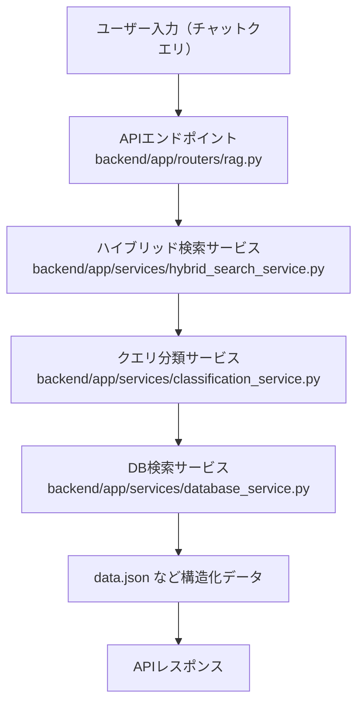

# DatabaseService 検索処理フロー・実装解説

## 概要
このドキュメントでは、GameChat AI バックエンドの `DatabaseService` クラスにおける構造化データ（JSON）検索の処理フロー、主な関数、データの流れを図解・解説します。

---

## 1. 検索リクエストの全体フロー



---

## 2. DatabaseService の主な関数呼び出し関係

- **filter_search / filter_search_async**
  - 検索キーワードを受け取り、構造化データから条件に合致するカード名リストを返す
  - 内部で `filter_search_titles_async` → `_filter_search_titles` を呼び出し

- **_filter_search_titles**
  - キーワードを正規化・分割し、各アイテムに対して `_match_filterable` で条件判定
  - マッチしたアイテムの name をリストアップ

- **_match_filterable**
  - 各アイテム（dict）とキーワードの組み合わせで、属性値や数値条件（例: コスト1、HP100以上）を判定

- **reload_data / _load_data**
  - data.json等からデータをロードし、self.data_cache, self.title_to_dataを構築

---

## 3. 検索処理の流れ（例: コスト1のカード検索）

1. ユーザーが「コスト1のカードを出力」と入力
2. APIエンドポイントでリクエスト受信
3. クエリ分類サービスで filterable（構造化DB検索）と判定
4. DatabaseService の `filter_search` または `filter_search_async` が呼ばれる
5. `_filter_search_titles` で self.data_cache 内の各アイテムに対し `_match_filterable` で条件判定
6. マッチしたカード名リストを返却

---

## 4. デバッグ・ログ出力ポイント

- `filter_search`/`filter_search_async`/`_search_filterable` などで print/logging によるデバッグ出力あり
- 検索件数や各アイテムのマッチ状況をターミナルで確認可能

---

## 5. 参考: コード例

```python
# 検索呼び出し例
service = DatabaseService()
results = service.filter_search(["コスト1"])
print(results)
```

---

## 6. 関連ドキュメント
- [ハイブリッド検索システム実装ガイド](./hybrid_search_guide.md)
- [構造化データ検索不具合 調査ログ](../structured_search_investigation.md)

---

> 最終更新: 2025-07-20
