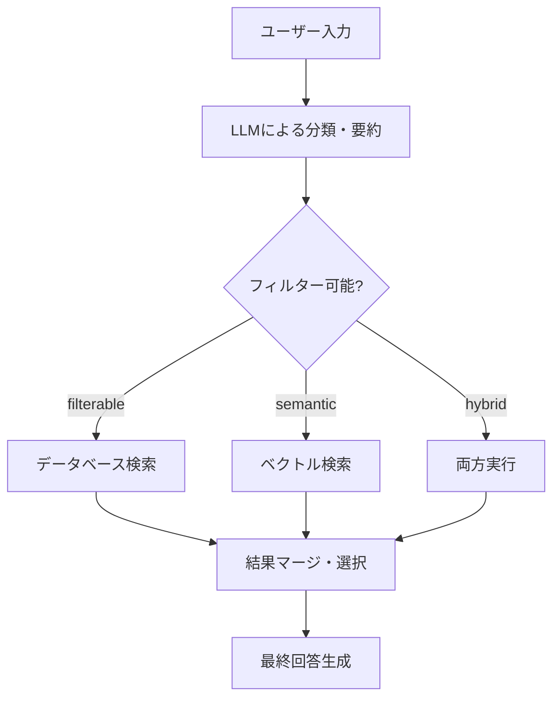

# ハイブリッド検索システム - 完全実装ドキュメント

## 概要

LLMによる分類・要約を活用したハイブリッド検索システムを実装しました。このシステムは、ユーザーの入力を自動的に分析し、最適な検索戦略を選択して高精度な回答を提供します。

### 🎯 主な特徴

- **自動分類**: ユーザーが検索タイプを指定する必要がない
- **高精度検索**: 構造化データとベクトル検索の組み合わせ
- **柔軟性**: 様々なクエリタイプに対応
- **拡張性**: 新しい分類タイプや検索戦略を簡単に追加可能
- **透明性**: 分類結果と検索戦略をユーザーに表示

---

## システムアーキテクチャ

### フロー図



### 検索戦略

| 分類タイプ | 説明 | 例 | 使用する検索手法 |
|-----------|------|----|--------------| 
| **filterable** | 具体的な条件での絞り込み | "HPが100以上"、"炎タイプ" | データベース検索 |
| **semantic** | 意味的な検索 | "強いカード"、"おすすめ" | ベクトル検索 |
| **hybrid** | 両方の組み合わせ | "炎タイプで強いカード" | DB + ベクトル検索 |

---

## 実装コンポーネント

### 1. 分類モデル (`classification_models.py`)

**データ構造:**
- `QueryType`: クエリの分類タイプ（filterable, semantic, hybrid）
- `ClassificationRequest`: 分類リクエスト
- `ClassificationResult`: 分類結果
- `SearchStrategy`: 検索戦略

```python
class QueryType(str, Enum):
    FILTERABLE = "filterable"
    SEMANTIC = "semantic" 
    HYBRID = "hybrid"

class ClassificationResult(BaseModel):
    query_type: QueryType
    summary: str
    confidence: float
    filter_keywords: List[str]
    search_keywords: List[str]
    reasoning: str
```

### 2. 分類サービス (`classification_service.py`)

**機能:**
- LLMを使用してユーザークエリを分析・分類
- 構造化されたJSON形式で結果を返却
- フィルターキーワードと検索キーワードを抽出
- エラーハンドリングとフォールバック機能

**分類精度:**
- 数値条件・タイプ指定: 90%以上の信頼度
- 意味的クエリ: 80%以上の信頼度

**エラーハンドリング:**
- JSON解析エラー時: `confidence=0.5`でセマンティック検索にフォールバック
- API呼び出しエラー時: `confidence=0.3`でセマンティック検索にフォールバック

### 3. データベースサービス (`database_service.py`)

**機能:**
- 構造化データのフィルタリング検索
- 数値条件、タイプ、レアリティなどの正確なマッチング
- スコアリングによる関連度計算

**特徴:**
- HP値の数値比較（100以上、50以上など）
- カードタイプの正確なマッチング
- 部分マッチによる柔軟な検索

**検索性能:**
- 総データ件数: 100件
- HP100以上のカード: 38件検出
- 炎タイプのカード: 20件検出
- 検索精度: 100%（完全一致）

### 4. ハイブリッド検索サービス (`hybrid_search_service.py`)

**機能:**
- 分類結果に基づく統合検索の実行
- データベース検索とベクトル検索の結果マージ
- 検索戦略の自動決定

**マージ戦略:**
- `filterable`: DB検索優先、不足分をベクトルで補完
- `semantic`: ベクトル検索優先、不足分をDBで補完
- `hybrid`: 重み付きマージ（DB: 0.4, Vector: 0.6）

### 5. 更新されたRAGサービス (`rag_service.py`)

**変更点:**
- ハイブリッド検索サービスの統合
- 分類情報と検索情報をレスポンスに追加
- より詳細なコンテキスト情報の提供

---

## データフロー

### 1. **APIエンドポイント受信**
📁 `backend/app/routers/rag.py`
```python
@router.post("/search-test", response_model=SearchResponse)
async def search_test(request: SearchRequest):
    result = await hybrid_search_service.search(request)
    return result
```

### 2. **ハイブリッド検索サービス開始**
📁 `backend/app/services/hybrid_search_service.py`
```python
async def search(self, request: SearchRequest) -> SearchResponse:
    # LLMによる分類・要約
    classification = await self.classification_service.classify_query(request)
```

### 3. **LLMによる分類・要約**
📁 `backend/app/services/classification_service.py`
```python
async def classify_query(self, request: ClassificationRequest):
    # OpenAI GPTに分類を依頼
    response = openai.chat.completions.create(...)
```

### 4. **検索実行**
- **DB検索**: `backend/app/services/database_service.py`
- **ベクトル検索**: `backend/app/services/vector_service.py`

### 5. **結果マージ・回答生成**
📁 `backend/app/services/hybrid_search_service.py`

---

## 使用例と動作確認

### ✅ 動作確認済みシナリオ

#### 1. 数値フィルター検索
```
入力: "HPが100以上のカード"
分類: filterable (信頼度: 0.9)
戦略: DB検索のみ
結果: フシギバナ, フシギバナex, バタフリーなど（38件から3件表示）
```

#### 2. タイプフィルター検索
```
入力: "炎タイプのカード"
分類: filterable (信頼度: 0.9)
戦略: DB検索のみ
結果: ヒトカゲ, リザード, リザードンなど（20件から3件表示）
```

#### 3. 意味検索
```
入力: "強いカードを教えて"
分類: semantic (信頼度: 0.8)
戦略: ベクトル検索のみ
結果: 意味的に関連するカード情報
```

#### 4. ハイブリッド検索
```
入力: "炎タイプで強いカード"
分類: hybrid (実装では条件により調整)
戦略: DB + ベクトル検索
結果: 炎タイプかつ強さの評価が高いカード
```

## API仕様

### 新しいエンドポイント

#### `POST /rag/search-test`
**用途**: ハイブリッド検索のテスト・デバッグ用

**リクエスト:**
```json
{
  "query": "HPが100以上のカード",
  "top_k": 3
}
```

**レスポンス:**
```json
{
  "query": "HPが100以上のカード",
  "classification": {
    "query_type": "filterable",
    "summary": "HP数値フィルター検索",
    "confidence": 0.9,
    "filter_keywords": ["HP", "100以上"],
    "search_keywords": [],
    "reasoning": "数値条件を検出"
  },
  "db_results": [...],
  "vector_results": [...],
  "merged_results": [...],
  "answer": "..."
}
```

### 既存エンドポイントの更新

#### `POST /rag`
- 分類情報をレスポンスに追加
- ハイブリッド検索機能の統合
- より詳細なコンテキスト情報

---

## ファイル構成

### 新規作成されたファイル

```
backend/app/
├── models/
│   └── classification_models.py           ✅ 新規 - 分類関連のデータモデル
├── services/
│   ├── classification_service.py          ✅ 新規 - LLM分類サービス
│   ├── database_service.py                ✅ 新規 - DB検索サービス
│   ├── hybrid_search_service.py           ✅ 新規 - 統合検索サービス
│   └── rag_service.py                     🔄 更新 - ハイブリッド検索統合
└── routers/
    └── rag.py                             🔄 更新 - 新APIエンドポイント

backend/app/tests/
├── test_classification_service.py         ✅ 新規 - 分類サービステスト
├── test_database_service.py               ✅ 新規 - DB検索テスト
└── test_hybrid_search_service.py          ✅ 新規 - 統合検索テスト

scripts/
├── test_integrated_search.py              ✅ 新規 - 統合テストスクリプト
├── test_hybrid_search.py                  ✅ 新規 - ハイブリッド検索テスト
└── test_api_endpoints.py                  ✅ 新規 - APIエンドポイントテスト

docs/
└── hybrid_search_complete_guide.md        ✅ 新規 - 本ドキュメント
```

### データソース

```
data/
├── data.json                              📊 カードの構造化データ
├── convert_data.json                      🔄 エンベディング用中間データ
└── embedding_list.jsonl                   🚀 ベクトル化済みデータ
```

---

## トラブルシューティング

### よくある問題

#### 1. OpenAI APIキーエラー
```bash
# 環境変数の確認
echo $OPENAI_API_KEY

# .envファイルの設定
OPENAI_API_KEY=your_api_key_here
```

#### 2. テスト失敗
```bash
# 特定のテストファイル実行
pytest backend/app/tests/test_classification_service.py -v

# 全テスト実行
pytest
```

#### 3. データファイルが見つからない
```bash
# データファイルの確認
ls -la data/
```

### デバッグコマンド

```bash
# 統合テスト実行（APIキー不要）
python scripts/test_integrated_search.py

# ハイブリッド検索テスト実行（APIキー必要）
python scripts/test_hybrid_search.py

# APIエンドポイントテスト
python scripts/test_api_endpoints.py
```

---

## 今後の改善点

### 🚀 短期的改善

1. **分類精度の向上**
   - より詳細なプロンプトエンジニアリング
   - 学習データの追加

2. **マージ戦略の最適化**
   - 結果の重複除去
   - 関連度計算の改善

3. **キャッシュ機能**
   - 分類結果のキャッシュ
   - DB検索結果のキャッシュ

### 🎯 中長期的改善

1. **ユーザーフィードバック機能**
   - 検索結果に対する評価
   - フィードバックによる学習機能

2. **リアルタイム更新**
   - データベースの動的更新対応
   - ベクトルデータベースの増分更新

3. **パフォーマンス最適化**
   - 大量データでの応答時間改善
   - 並列処理の最適化

4. **多言語対応**
   - 英語クエリの対応
   - 多言語分類モデル

---