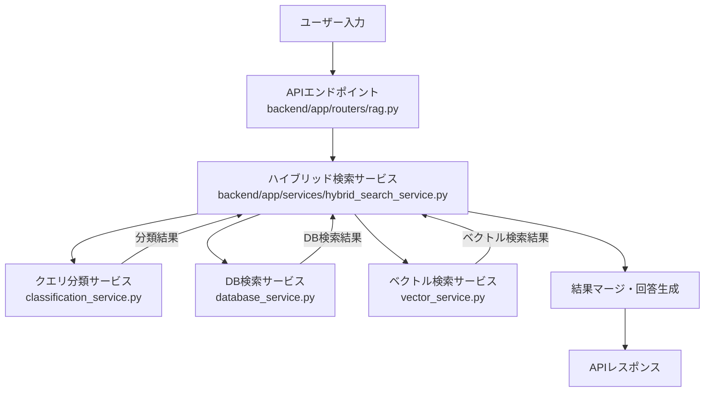

# 検索リクエスト時のコード実行フロー図・解説

## 概要
ユーザーが検索クエリを送信した際、どのファイルのどの関数・クラスがどの順で呼ばれるかを図解し、主要な役割・データの流れをまとめます。

---

## 1. 全体フロー図（ハイブリッド検索システム）



---

## 2. 主要ファイル・関数の呼び出し関係

### 1. APIエンドポイント
- **ファイル**: `backend/app/routers/rag.py`
- **関数例**:
  ```python
  @router.post("/search-test", response_model=SearchResponse)
  async def search_test(request: SearchRequest):
      result = await hybrid_search_service.search(request)
      return result
  ```

### 2. ハイブリッド検索サービス
- **ファイル**: `backend/app/services/hybrid_search_service.py`
- **関数**: `async def search(self, request: SearchRequest) -> SearchResponse`
  - LLMによるクエリ分類（classification_service.classify_query）
  - 分類結果に応じてDB/ベクトル/両方の検索を呼び出し
  - 結果をマージし、回答生成

### 3. クエリ分類サービス
- **ファイル**: `backend/app/services/classification_service.py`
- **関数**: `async def classify_query(self, request: ClassificationRequest)`
  - OpenAI GPT APIでクエリタイプ判定（filterable/semantic/hybrid）
  - 分類結果を返却

### 4. DB検索サービス
- **ファイル**: `backend/app/services/database_service.py`
- **関数例**: `filter_search`, `structured_search` など
  - 構造化データ（data.json等）に対する条件検索

### 5. ベクトル検索サービス
- **ファイル**: `backend/app/services/vector_service.py`
- **関数**: `async def search(self, ...)`, `async def search_parallel(self, ...)`
  - Upstash Vectorを用いた意味検索
  - 分類結果に応じたパラメータ最適化

---

## 3. データの流れ（例: ベクトル検索）

1. **ユーザー入力**
    - 例: 「強いカードを教えて」
2. **API受信**
    - `/rag/search-test` などのエンドポイントで受信
3. **ハイブリッド検索サービス**
    - `search()`でクエリ分類 → 検索戦略決定
4. **クエリ分類サービス**
    - `classify_query()`でクエリタイプ判定（semantic）
5. **ベクトル検索サービス**
    - `search()`または`search_parallel()`でUpstash Vectorに問い合わせ
    - `vector_service.py`の`search`関数内でパラメータ最適化・ネームスペース選択・スコア閾値調整
6. **検索結果マージ・回答生成**
    - 検索結果を統合し、最終回答を生成
7. **APIレスポンス返却**

---

## 4. 参考: 主要ファイルの役割

| ファイル | 主な役割 |
|----------|-----------------------------|
| routers/rag.py | APIエンドポイント定義 |
| services/hybrid_search_service.py | 検索戦略の統合・実行 |
| services/classification_service.py | クエリ分類（LLM利用） |
| services/database_service.py | 構造化データ検索 |
| services/vector_service.py | ベクトル検索（Upstash Vector） |
| models/classification_models.py | クエリ分類の型定義 |

---

## 5. 補足: ベクトル検索サービスの詳細

- **ファイル**: `backend/app/services/vector_service.py`
- **主な関数**:
    - `search()`: 通常のベクトル検索（パラメータ最適化あり）
    - `search_parallel()`: 複数ネームスペースの並列検索
    - `_optimize_search_params()`: 分類結果に基づくパラメータ最適化
    - `_get_all_namespaces()`: 検索対象ネームスペースの動的取得
- **ポイント**:
    - クエリ分類（classification）に応じてtop_kやmin_score、namespaceを自動調整
    - Upstash VectorのAPIを直接呼び出し、スコア閾値やネームスペースごとに検索
    - 検索結果はカード名リストや詳細情報として返却

---

## 6. 参考ドキュメント
- [`docs/guides/hybrid_search_guide.md`](../../docs/guides/hybrid_search_guide.md)
- [`docs/guides/vector_search_optimization_guide.md`](../../docs/guides/vector_search_optimization_guide.md)
- [`README.md`](../../README.md)

---

> 本ドキュメントは「ユーザーからクエリを受け取った際、どのファイルのどのコードが動いているか」を可視化するためのものです。システムの理解・デバッグ・新規開発時の参考にご活用ください。
